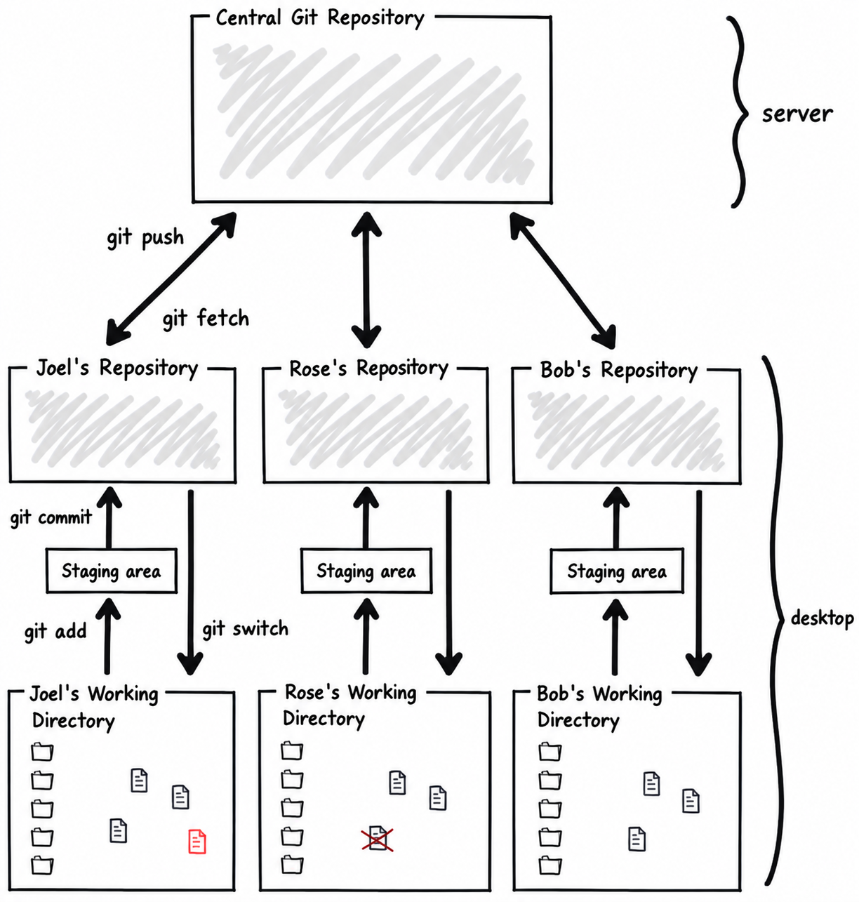

*Adapted from Joel Spolsky’s Hg Init. The first-person stories below belong to the original tutorial; the commands and technical explanations have been adapted for Git.*

When the programmers at my company decided to switch from Subversion to Git, _boy_ was I confused.

First, I came up with all kinds of stupid reasons why we shouldn't switch. “We have to keep the repository on a central server, so it will be safe,” I said. You know what? I was wrong. In Git a normal, full clone gives every developer the repository's history on their hard drive. And anyway, almost every Git team uses a central repository, too, which you can back up compulsively, and you can build a three-ringed security zone complete with layers of Cylons, Stormtroopers, and adorable labradoodles (or whatever your IT department requires). Local commits still need a backup or a push if you want them safe from a broken laptop.

“The trouble with distributed version control is that it makes it too easy to branch,” I said, “and branching always causes problems.” Turns out this was wrong, too. I was on a streak. Git makes branches cheap and records the ancestry needed to merge their work. Merging is not always painless, but branching is commonplace and useful. Modern Subversion also tracks merges; the old horror stories here explain the fear of branching, not a promise that every Git merge will be automatic.

Then I said, “Fine, I'll use it, but don't expect me to be able to figure it out.” And I asked Jacob to make me a cheat sheet listing all the things that I normally did in Subversion, and the equivalent way to do them in Git.

Now, I could show you this cheat sheet, but I won't, because it messed up my brain for months.

It turns out that if you've been using Subversion, your brain is a little bit, um, how can I say this politely? You're brain damaged. No, that's not polite. You need a little re-education. I walked around brain damaged for six months thinking that Git was _more_ complicated than Subversion, but that was only because I didn't understand how it really worked, and once I did, it turns out—hey presto!—it's really kind of simple.

So I wrote this tutorial for you, in which I have been very careful _not_ to explain things in terms of Subversion, because there is just no reason to cause any more brain damage. The world is brain damaged enough. Instead, for those of you who are coming from Subversion, I've got this one chapter at the beginning that will try to reverse as much damage as possible so that you can learn Git from a clean slate.

**If you've never used Subversion, you can skip ahead to the next chapter ( [Ground Up Git](01.html)) without missing anything.**

Ready? OK, let's start with a short quiz.

**Question 1.** Do you write perfect code the first time?

If you answered “Yes” to question 1, you're a liar and a cheat. You fail. Take the test again.

New code is buggy. It takes a while to get it working respectably. In the meantime, it can cause trauma for the other developers on the team.

Now, here's how Subversion works:

- When you check new code in on a shared Subversion branch, it is on the server for everyone else to get on their next update.

Since all new code that you write has bugs, you have a choice.

- You can check in buggy code and drive everyone else crazy, or
- You can avoid checking it in until it's fully debugged.

Working directly on a shared Subversion trunk gives you this dilemma. Either the trunk includes new code that was just written, _or_ new code that was just written is not in the repository. You can use a private server-side branch, but you still need the server to commit.

As Subversion users, we are so used to this dilemma that it's hard to imagine it not existing.

Subversion team members often go days or weeks without checking anything in. In Subversion teams, newbies are terrified of checking any code in, for fear of breaking the build, or pissing off Mike, the senior developer, or whatever. Mike once got so angry about a checkin that broke the build that he stormed into an intern's cubicle and swept off all the contents of his desk and shouted, “This is your last day!” (It wasn't, but the poor intern practically wet his pants.)

All this fear about checkins means people write code for weeks and weeks _without the benefit of version control_ and then go find someone senior to help them check it in. Why have version control if you can't use it?

Here's a simple illustration of life under Subversion:

In Git, _every developer has their own repository, living on their desktop:_

Fetching updates the repository's knowledge of remote work. It does not change your working files. Switching branches checks out a local snapshot; merging integrates another line of work. We'll walk through those steps with a real recipe.

So you can commit your code to your private repository, and get all the benefit of version control, whenever you like. Every time you reach a logical point where your code is a little bit better, you can commit it.

Once it's solid, and you're willing to let other people use your new code, you _push_ your changes from your repository to a central repository that everyone else pulls from, and they finally see your code. When it's ready.

_Git separates the act of committing new code from the act of inflicting it on everybody else._

And that means that you can stage changes with **git add** and commit (**git commit**) without anyone else getting your changes. When you've got a bunch of changes that you like that are stable and all is well, you push them ( **git push**) to the main repository.

## One more big conceptual difference

You know how every single street has a name?

Well, yeah, turns out that in Japan, not so much. They usually just number the [blocks](http://sivers.org/jadr) in between the streets, and only very, very important streets get names.

There's a similar change in vocabulary when you move from Subversion to Git.

Subversion likes to think about _revisions_. A revision is what the entire file system looked like at some particular point in time.

In Git, you think about _commits_. A commit names a snapshot of the tracked files and records its parent commits, author, and message. Git identifies commits with hashes, not one server-wide sequence of revision numbers. Comparing two snapshots gives you a changeset—the patch between them.

Six of one, half dozen of the other: what's the difference?

Here's the difference. Imagine that you and I are working on some code, and we branch that code, and we each go off into our separate workspaces and make lots and lots of changes to that code separately, so they have diverged quite a bit.

When we have to merge, looking only at my finished files and your finished files would leave us guessing which changes to keep. We need to know where we started, too.

While we were working separately in Git, Git was recording commits and their ancestry. A normal three-way merge compares the two tips with their common ancestor. It combines the changes each side made from that shared starting point; it does not replay every intermediate edit one by one.

For example, if I change a function a little bit and you change a different function, Git can usually combine the two edits. If we both change the same lines, it may ask us to decide what the result should be. Moving or renaming code can complicate matters. Git can detect many renames, but it doesn't understand the program's intent.

Since commits travel with their ancestry, you get to do interesting things with them. You can push a branch to a friend on the team to try out, instead of pushing it to the shared main branch and inflicting it on everybody.

If this all seems a bit confusing, don't worry—by the time you get through this tutorial, it'll all make perfect sense. For now the most important thing to know is that Git records _how the histories fit together_, so it has a shared starting point when it combines them.

And that means that _you can feel free to branch_. There may still be conflicts, but you have a systematic way to bring the work back together.

Want to know something funny? Almost every Subversion team I've spoken to has told me some variation on the very same story. This story is so common I should just name it “Subversion Story #1.” The story is this: at some point, they tried to branch their code, usually so that the shipping version which they gave their customers can be branched off separately from the version that the developers are playing with. And every team has told me that when they tried this, it worked fine, _until they had to merge_, and then it was a nightmare. What should have been a five minute process ended up with six programmers around a single computer working for two weeks trying to manually reapply every single bug fix from the stable build back into the development build.

And almost every Subversion team told me that they vowed “never again,” and they swore off branches. And now what they do is this: each new feature is in a big #ifdef block. So they can work in one single trunk, while customers never see the new code until it's debugged, and frankly, that's ridiculous.

Keeping stable and dev code separate is _precisely what source code control is supposed to let you do_.

When you switch to Git, you may not even realize it, but branching becomes possible again, and you don't have to be afraid.

That means you can have team repositories, where a small team of programmers collaborates on a new feature, and when they're done, they merge it into the main development repository, and _it works!_

That means you can have a QA repository that lets the QA team try out the code. If it works, the QA team can push it up to the central repository, meaning, the central repository always has solid, tested code. And _it works!_

That means you can run experiments in separate repositories, and if they work, you can merge them into the main repository, and if they don't work, you can abandon them, and _it works!_

## One last big conceptual difference

The last major conceptual difference between Subversion and Git is not as big a deal, but it will trip you up if you're not aware of it, and here it is:

Git commits record a snapshot of the tracked files across the repository—including subdirectories. The extra idea to learn is the _staging area_: you select the next snapshot with **git add** before recording it with **git commit**.

The main way you notice this is that in Subversion, committing from a subdirectory normally limits the operation to that part of the tree. In Git, **git commit** with no path arguments records everything already staged, even if you run it from a subdirectory. But **git add .** stages changes under your current directory, so where you run it matters. Check **git status** and **git diff --staged** before committing.

This is not a big deal, but if you're used to checking out only a small corner of one enormous company repository, a full Git clone is a different experience. Separate repositories for independent projects can make sense. Large Git repositories and sparse checkouts also exist; choose the arrangement that fits your project.

## And finally…

Here's the part where you're just going to have to take my word for it.

For this way of working, I prefer Git to Subversion.

It is a better way of working on source code with a team. It is a better way of working on source code by yourself.

It is just _better._

And, mark my words, if you understand the way Git works, and you work the way Git works, and you don't try to fight it, and you don't try to do things the old Subversion way using Git but instead you learn to work the way Git expects you to work, you will be happy, successful, and well-fed, and you'll always be able to find the remote control to the TV.

And in the early days, you will be tempted, I know you will, to give up on Git and go back to Subversion, because it will be strange, like living in a foreign country, and you'll be homesick. You will come up with all kinds of rationalizations, like complaining that local history takes up disk space. It does take space, especially for large binary files, but it also lets you inspect and commit your work without calling the server.

And then you'll go back to Subversion because you tried to branch the Subversion way, and you got confused. In Git, you normally create a branch in your existing repository with **git switch -c feature**. You can clone another repository too, but you don't need a whole new clone just to start a line of work.

And then you'll get Jacob, or whoever the equivalent of Jacob is at your office, to give you the “Subversion to Git cheat sheet,” and you'll spend three months thinking that **git fetch** is just like **svn up** (it isn't: fetch doesn't update your working files), without really knowing what **git fetch** does, and one day, things will go wrong and you'll blame Git, when you really should be blaming yourself for not understanding how Git works.

I know you'll do that because that is what I did.

Don't make the same mistake. Learn Git, trust Git, and figure out how to do things the Git way, and you will move an entire generation ahead in source code control. While your competitors are busy taking a week to resolve all the merge conflicts they got when a vendor updated a library, you're going to type **git merge feature** and say to yourself, “Oh gosh, that's cool, it just worked.” And Mike will chill out and share a doobie with the interns, and soon it will be spring and the kids at the nearby college will trade in their heavy parkas for skimpy A&F pre-torn T-shirts, and life will be good.
