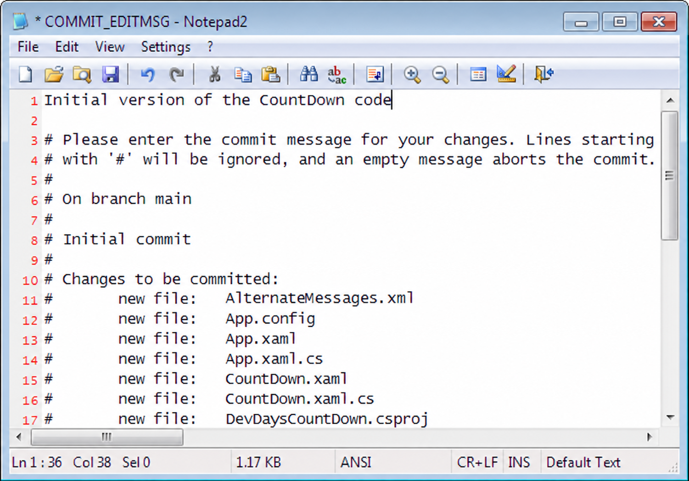
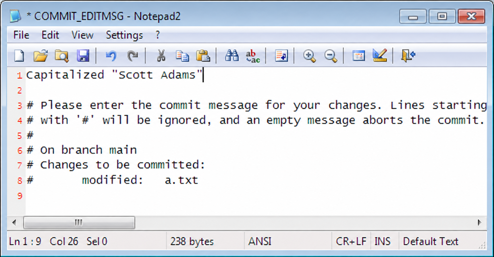
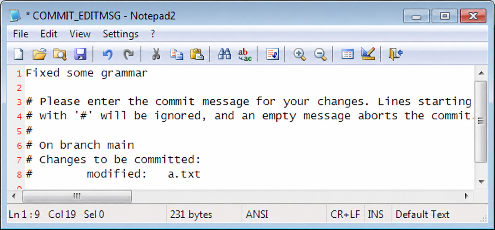

Git is a _version control system_. Developers use it to manage source code.
It serves two important purposes:

1. It keeps track of the versions of files you commit
2. It can merge different versions of your code, so that teammates can work independently on the code and then merge their changes

Without Git, you could try to keep old versions
just by making a lot of copies of the directory containing all your code:

This is tedious, takes up a lot of disk space, and confusing. Using version control is a better way to do this.

Most people work with Git through the command line, which works on Windows, Unix, and Mac. The command for Git is **git**:

<pre><samp>
c:\gitinit> <kbd>git</kbd>
Selected commands (abbreviated help):
  init       Create an empty Git repository
  add        Add file contents to the staging area
  commit     Record staged changes
  log        Show commit history
  diff       Show changes between snapshots
  status     Show working tree and staging status
  restore    Restore working tree files
  switch     Switch branches
  clone      Clone a repository
  fetch      Download objects and remote references
  merge      Join development histories
  push       Update remote references
</samp></pre>

Typing **git** without anything else gives you a list of the most common commands that are available. You can also try **git help** for help, or **git help -a** for a list of commands. Install Git from [git-scm.com](https://git-scm.com/downloads) if **git --version** is not available. These examples use Windows Command Prompt; the Git commands also work in other shells. The transcript hashes below are illustrative; use the hashes from your own log.

Before the first commit, set your identity for this repository with **git config user.name "Your Name"** and **git config user.email "you@example.com"** after running init. These values identify the author; they do not log you into a server.

To take advantage of version control, you needed a _repository_. A repository stores all your old versions of every file. Git represents each commit as a snapshot, reuses unchanged file contents, and compresses its storage. You get the old versions without making a separate full directory copy every time.

In the old days, getting a repository was a big deal. You had to have a central server somewhere and you had to install software on it. Git is _distributed_, so you can use it without a fancy central server. You can run it entirely on your own computer. And getting a repository is super-easy: you just go into the top-level directory where all your code lives…

<pre><samp>
c:\gitinit> <kbd>cd CountDown</kbd>
c:\gitinit\CountDown> <kbd>dir /a /w</kbd>
 Volume in drive C has no label.
 Volume Serial Number is 9862-36C5
 Directory of c:\gitinit\CountDown
[.]                       [..]                      a.txt
AlternateMessages.xml     App.config                App.xaml
App.xaml.cs               CountDown.xaml            CountDown.xaml.cs
DevDaysCountDown.csproj   favicon.ico               [Images]
[Properties]              [TweetSharp]
               9 File(s)        155,932 bytes
               5 Dir(s)  76,083,609,600 bytes free
</samp></pre>

  … there’s my code, and you type git init:

<section aria-labelledby="tip-git-init" class="tip">
  <h4 id="tip-git-init">git init</h4>
  
 creates a repository

</section>

<pre><samp>
c:\gitinit\CountDown> <kbd>git init -b main</kbd>
Initialized empty Git repository in C:/gitinit/CountDown/.git/
c:\gitinit\CountDown> 
</samp></pre>

Git confirms that it created the repository. If you look closely, you’ll see that there’s a new directory there, named **.git**:

<pre><samp>
c:\gitinit\CountDown> <kbd>dir /a /w</kbd>
Volume in drive C has no label.
Volume Serial Number is 9862-36C5
Directory of c:\gitinit\CountDown
[.]                       [..]                      [.git]
a.txt                     AlternateMessages.xml     App.config
App.xaml                  App.xaml.cs               CountDown.xaml
CountDown.xaml.cs         DevDaysCountDown.csproj   favicon.ico
[Images]                  [Properties]              [TweetSharp]
               9 File(s)        155,932 bytes
               6 Dir(s)  76,083,650,560 bytes free
</samp></pre>
That’s the repository! It’s a directory full of everything Git needs. Settings, old version of files, tags, an extra pair of socks for when it rains, etc. _Don’t go in there._ You are almost never going to want to mess with that directory directly.

OK, now that we have a fresh new repository, we’re going to want to add all these source files to it. That’s easy, too: just type **git add .**. Before doing this in your own project, make sure local secrets and generated files are excluded by your **.gitignore**.

<section aria-labelledby="tip-git-add" class="tip">
  <h4 id="tip-git-add">git add</h4>
  
 stages the current file contents for the next commit. Editing a file again requires staging it again

</section>

<pre><samp>
c:\gitinit\CountDown> <kbd>git add .</kbd>

</samp></pre>
There’s still one more step… you have to _commit_ your changes. What changes? The change of adding all those files.

Why do you have to commit? With Git, committing says “hey, the way the staged files look—please remember that.” It’s like making a copy of the whole directory… every time you have something that you’ve changed that you sorta like, you commit.

<section aria-labelledby="tip-git-commit" class="tip">
  <h4 id="tip-git-commit">git commit</h4>
  
 saves the staged snapshot to the repository

</section>

<pre><samp>
c:\gitinit\CountDown> <kbd>git commit</kbd>
</samp></pre>
Git will pop up your configured editor so that you can type a commit message. These recreated screenshots use Notepad2 like the original tutorial; your editor may look different. You can choose an installed editor with **git config core.editor** (for example, **git config core.editor "notepad"** on Windows), or use **git commit -m "Your message"** to supply the message directly. This is just something you type to remind yourself of what changed in this commit.

When you save and exit, your files will be committed.

You can type **git log** to see a history of changes. It’s like your repository’s blog:

<section aria-labelledby="tip-git-log" class="tip">
  <h4 id="tip-git-log">git log</h4>
  
 shows the history of changes committed to the repository

</section>

<pre><samp>
c:\gitinit\CountDown> <kbd>git log</kbd>
commit da5f372c3901
Author: Joel Spolsky &lt;joel@joelonsoftware.com&gt;
Date:   Fri Feb 05 13:04:30 2010 -0500

    Initial version of the CountDown code
</samp></pre>

Let’s edit a file and see what happens.

<section class="diff">
<h3>a.txt</h3>

<del>Scott Adams</del><ins>SCOTT ADAMS</ins>: Normal people believe that if it ain't
broke, don't fix it. Engineers believe that if it
ain't broke, it doesn't have enough features yet.

</section>

Now that we’ve made another change, we stage **a.txt** and commit it using **git commit**:

<pre><samp>
c:\gitinit\CountDown> <kbd>git add a.txt</kbd>
c:\gitinit\CountDown> <kbd>git commit</kbd>

</samp></pre>

Notice that Git has figured out that only one file, a.txt, is staged:

And now that I’ve committed, let’s take a look at the log:

<pre><samp>
c:\gitinit\CountDown> <kbd>git log</kbd>
commit a9497f468dc3
Author: Joel Spolsky &lt;joel@joelonsoftware.com&gt;
Date:   Fri Feb 05 13:26:13 2010 -0500

    Capitalized "Scott Adams"
commit da5f372c3901
Author: Joel Spolsky &lt;joel@joelonsoftware.com&gt;
Date:   Fri Feb 05 13:04:30 2010 -0500

    Initial version of the CountDown code
</samp></pre>

Like any modern blogger, Git puts the newest stuff on top.

I’m going to make one more change, just to amuse myself.

<section class="diff">
<h3>a.txt</h3>

SCOTT ADAMS: Normal people believe that if it <del>ain't broke</del><ins>isn't broken</ins>,
don't fix it. Engineers believe that if it
<del>ain't broke</del><ins>isn't broken</ins>, it doesn't have enough features yet.

</section>

Committing:

<pre><samp>
c:\gitinit\CountDown> <kbd>git add a.txt</kbd>
c:\gitinit\CountDown> <kbd>git commit</kbd>
</samp></pre>
My commit message:

And now what does the log show?
<pre><samp>
c:\gitinit\CountDown> <kbd>git log</kbd>
commit 55490459b740
Author: Joel Spolsky &lt;joel@joelonsoftware.com&gt;
Date:   Fri Feb 05 13:47:43 2010 -0500

    Fixed some grammar
commit a9497f468dc3
Author: Joel Spolsky &lt;joel@joelonsoftware.com&gt;
Date:   Fri Feb 05 13:26:13 2010 -0500

    Capitalized "Scott Adams"
commit da5f372c3901
Author: Joel Spolsky &lt;joel@joelonsoftware.com&gt;
Date:   Fri Feb 05 13:04:30 2010 -0500

    Initial version of the CountDown code
</samp></pre>

OK, that was a lot of fun. I made some changes, and each time
I made a significant change, I committed it to the repository.

I know what you’re thinking. You’re thinking, “JOEL, THIS ALL SEEMS LIKE A BIG WASTE OF TIME.”
Why go through all this rigamarole of committing?

Patience, young grasshopper. You’re about to learn how to get some benefit out of this.

Number one. Let’s say you make a huge mistake editing.

<section class="diff">
<h3>a.txt</h3>

<del>SCOTT ADAMS: Normal people believe that if it isn't broken, don't fix it. Engineers believe that if it isn't broken, it doesn't have enough features yet.</del>
<ins>DAN QUAYLE: Illegitimacy is something we should talk about in terms of not having it.</ins>

</section>

And then, gosh, just for good measure you delete a couple of
really important files.
<pre><samp>
c:\gitinit\CountDown> <kbd>del favicon.ico</kbd>
c:\gitinit\CountDown> <kbd>del App.xaml</kbd>
</samp></pre>
In the days before Git, this would be a good opportunity to go crying
to the system administrator and asking piercingly sad questions about
_why_ the backup system is “temporarily” out of commission and has been
for the last eight months.

The system administrator, whom everybody calls Taco, is too shy to eat lunch
with the rest of the team. On those rare occasions where he is away from his swivel office
chair, you will notice a triangular-shaped salsa-colored stain on the seat where
drippings of his many Mexican lunches fell between his legs, insuring that nobody takes
his chair, even though it is the superior Herman Miller variety that the company founders bought
themselves, not the standard-issue Staples $99 special that causes everyone else
back pain.

Anyway, yeah, there’s no backup.

Thanks to Git, though, when you’re unhappy with your changes, you can just issue
the handy command **git restore**. In this example nothing has been staged since the last commit, so restoring the working files from the staging area brings them back to the committed version. It discards these uncommitted edits without making backup copies; review **git diff** first.

<section aria-labelledby="tip-git-restore" class="tip">
  <h4 id="tip-git-restore">git restore</h4>
  
 revert changed files back to committed version

</section>

<pre><samp>
c:\gitinit\CountDown> <kbd>git restore .</kbd>
c:\gitinit\CountDown> <kbd>type a.txt</kbd>
SCOTT ADAMS: Normal people believe that if it isn't
broken, don't fix it. Engineers believe that if it
isn't broken, it doesn't have enough features yet.
</samp></pre>

I used **.** from the project root to restore all tracked files under that directory. If you've staged changes too, **git restore .** restores the staged version, not necessarily the last commit. We'll separate these kinds of undo in [Fixing Goofs](03.html).

So, when you’re working on source code with Git:

1. Make some changes
2. See if they work
3. If they do, **stage** them with **git add** and **commit** them
4. If they don’t, **restore** the unwanted edits after reviewing them
5. GOTO 1

(I know. Between the Windows command prompt and the GOTO statements, I am the _least cool programmer_ who ever lived.)

<section aria-labelledby="tip-git-status" class="tip">
  <h4 id="tip-git-status">git status</h4>
  
 shows a list of changed files

</section>

As time goes on, you may get confused about where you are and what
changes you’ve made since the last commit. Git keeps
track of all that for you. All you have to do is type **git status** and
Git will give you a list of files that have changed.

Suppose I create a file, edit a file, and delete a file.

<pre><samp>
c:\gitinit\CountDown> <kbd>copy a.txt b.txt</kbd>
    1 file(s) copied.
c:\gitinit\CountDown> <kbd>notepad2 a.txt</kbd>
c:\gitinit\CountDown> <kbd>del favicon.ico</kbd>
c:\gitinit\CountDown> <kbd>git status --short</kbd>
 M a.txt
 D favicon.ico
?? b.txt
</samp></pre>

**git status --short** uses two columns. The first describes staged changes; the second describes unstaged changes. Here “ M” means an unstaged modification, “ D” means an unstaged deletion, and “??” means an untracked file. Git doesn't have that file in its next snapshot. Yet.

Let’s deal with these changes one at a time. That modified file, **a.txt**.
What’s modified about it? You may have forgotten what you changed! Heck, I can
barely even remember what I ate for breakfast most days. Which is especially worrisome
because it’s ALWAYS CHEERIOS. Anyway, a.txt has changed. What changed?

There’s a command for that: **git diff** tells you exactly what’s changed
between your working files and the staging area. **git diff --staged** shows what is staged relative to the last commit.

<section aria-labelledby="tip-git-diff" class="tip">
  <h4 id="tip-git-diff">git diff</h4>
  
 shows what changed in a file

</section>

<pre><samp>
c:\gitinit\CountDown> <kbd>git diff a.txt</kbd>
diff --git a/a.txt b/a.txt
--- a/a.txt
+++ b/a.txt
@@ -1,3 +1,3 @@
-SCOTT ADAMS: Normal people believe that if it isn't
+SCOTT ADAMS: Civilians believe that if it isn't
 broken, don't fix it. Engineers believe that if it
 isn't broken, it doesn't have enough features yet.
</samp></pre>

This format is a little bit cryptic, but the interesting part
is that you can see some lines that begin with a minus,
which were removed, and lines that begin with a plus, which
were added, so you can see here that “Normal people” was edited to be “Civilians”.

<section aria-labelledby="tip-git-rm" class="tip">
  <h4 id="tip-git-rm">git rm</h4>
  
 schedules files to be removed from
    the repository. They disappear from the new committed snapshot when you commit. The command also removes working files if they still exist.

</section>

Now. That missing file, favicon.ico. As earlier, if you didn’t mean to
delete it, you can **git restore favicon.ico**, but let’s assume you really did mean
to remove it. Whenever you remove (or add) a file, you have to tell Git:

<pre><samp>
c:\gitinit\CountDown> <kbd>git rm favicon.ico</kbd>
c:\gitinit\CountDown> <kbd>git status --short</kbd>
 M a.txt
D  favicon.ico
?? b.txt
</samp></pre>

The “D” in the first column means “deletion staged” so the next time we commit in Git this file will be
removed. (The _history_ of the file will remain in the repository, so of course
we can always get it back). Finally, we need to add that new file, **b.txt**:

<pre><samp>
c:\gitinit\CountDown> <kbd>git add .</kbd>
c:\gitinit\CountDown> <strong>git status --short</strong>
M  a.txt
A  b.txt
D  favicon.ico
</samp></pre>

“A” means “Added.” Running **git add .** also staged the edited **a.txt**. Git does not abbreviate command names automatically: **git st** needs a user-defined alias. Here we're spelling out **git status --short**.

Having staged the modification, addition, and deletion, I can go ahead and check in my changes:

<pre><samp>
c:\gitinit\CountDown> <kbd>git commit</kbd>
c:\gitinit\CountDown> <kbd>git log</kbd>
commit 2f4718ee168e
Author: Joel Spolsky &lt;joel@joelonsoftware.com&gt;
Date:   Fri Feb 05 14:54:45 2010 -0500

    A few highly meaningful changes. No favicon.ico no more.

commit 55490459b740
Author: Joel Spolsky &lt;joel@joelonsoftware.com&gt;
Date:   Fri Feb 05 13:47:43 2010 -0500

    Fixed some grammar

commit a9497f468dc3
Author: Joel Spolsky &lt;joel@joelonsoftware.com&gt;
Date:   Fri Feb 05 13:26:13 2010 -0500

    Capitalized "Scott Adams"

commit da5f372c3901
Author: Joel Spolsky &lt;joel@joelonsoftware.com&gt;
Date:   Fri Feb 05 13:04:30 2010 -0500

    Initial version of the CountDown code
</samp></pre>

One more thing about **git log**: the _commit_ line identifies each commit with a hexadecimal hash. Git does not assign local revision numbers 0, 1, 2, 3. You can usually use a unique prefix of the hash. **HEAD** means the current commit; **HEAD~1** is its first parent. Our four illustrative hashes above identify the initial version, capitalization, grammar correction, and final edit.

Remember that Git keeps, in the repository, enough information
to reconstruct any old version of any file.

<section aria-labelledby="tip-git-show" class="tip">
  <h4 id="tip-git-show">git show</h4>
  
 shows any revision of any file.

</section>

First of all, the simple command **git show** can be used to print any old version
of a file. For example, to see what a.txt looks like now:

<pre><samp>
c:\gitinit\CountDown> <kbd>git show HEAD:a.txt</kbd>
SCOTT ADAMS: Civilians believe that if it isn't
broken, don't fix it. Engineers believe that if it
isn't broken, it doesn't have enough features yet.
</samp></pre>

To see what it looked like in the past, pick a commit hash from the log. Use **git show COMMIT:path**, with the path relative to the repository root:

<pre><samp>
c:\gitinit\CountDown> <kbd>git show da5f372c3901:a.txt</kbd>
Scott Adams: Normal people believe that if it ain't
broke, don't fix it. Engineers believe that if it
ain't broke, it doesn't have enough features yet.
</samp></pre>

If the file is long and complicated, and only a little bit of it changed,
I can give **git diff** two commit hashes and a path. For example, to see what changed between the initial version and the capitalization commit:

<pre><samp>
c:\gitinit\CountDown> <kbd>git diff da5f372c3901 a9497f468dc3 -- a.txt</kbd>
diff --git a/a.txt b/a.txt
--- a/a.txt
+++ b/a.txt
@@ -1,3 +1,3 @@
-Scott Adams: Normal people believe that if it ain't
+SCOTT ADAMS: Normal people believe that if it ain't
 broke, don't fix it. Engineers believe that if it
 ain't broke, it doesn't have enough features yet.
</samp></pre>

Finally, if you haven’t collapsed yet from exhaustion, before
I finish this tutorial, I just want to show you _one more tiny thing:_ you can use
the **git switch** command to go backwards or forwards in time
to any revision you want. Well, you can’t really go into the
future _per se_, although that would be super-cool. If you only had four commits
you would just **git switch --detach future-commit** and get some really
cool anti-gravity sci-fi futuristic version of your source code.
But of course, that is not possible.

<section aria-labelledby="tip-git-switch" class="tip">
  <h4 id="tip-git-switch">git switch</h4>
  
 update the working directory to a particular revision

</section>

What is possible is going _back_ to any version. Watch:

  <pre><samp>
c:\gitinit\CountDown> <kbd>git switch --detach da5f372c3901</kbd>
HEAD is now at da5f372 Initial version of the CountDown code
c:\gitinit\CountDown> <kbd>type a.txt</kbd>

Scott Adams: Normal people believe that if it ain't
broke, don't fix it. Engineers believe that if it
ain't broke, it doesn't have enough features yet.

c:\gitinit\CountDown> <kbd>git switch --detach a9497f468dc3</kbd>
HEAD is now at a9497f4 Capitalized "Scott Adams"

c:\gitinit\CountDown> <kbd>type a.txt</kbd>
SCOTT ADAMS: Normal people believe that if it ain't
broke, don't fix it. Engineers believe that if it
ain't broke, it doesn't have enough features yet.

c:\gitinit\CountDown> <kbd>git switch main</kbd>
Switched to branch 'main'

c:\gitinit\CountDown> <kbd>type a.txt</kbd>
SCOTT ADAMS: Civilians believe that if it isn't
broken, don't fix it. Engineers believe that if it
isn't broken, it doesn't have enough features yet.
</samp></pre>

**git switch** is actually modifying every file in the directory that changed
to go backwards and forwards through time. If a file was added or removed, it adds or removes it.
**git switch main** returns to our branch's latest commit. **--detach** lets you inspect a historical commit without moving that branch. Start with a clean working tree. If you want to make new commits from that old version, create a branch with **git switch -c experiment** first.

## Test yourself

OK! That’s it for tutorial one. Here’s all the things you should know how to do now:

1. Create a repository
2. Add and remove files in a repository
3. After making changes, see what uncommitted changes you made, then
4. … commit if you like them,
5. … or restore the unwanted edits if you don’t.
6. See old versions of files, or even move your directory backwards and forwards in time
