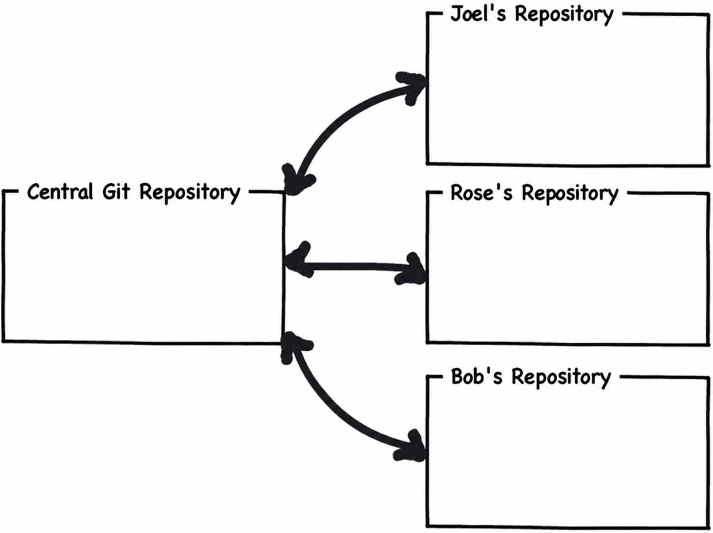
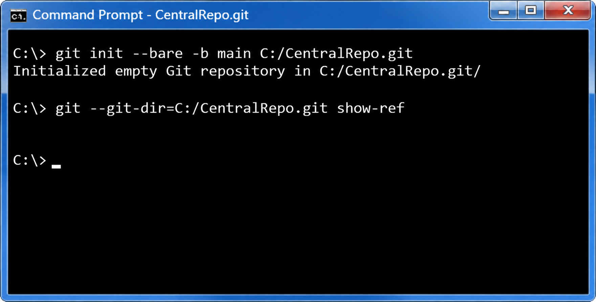
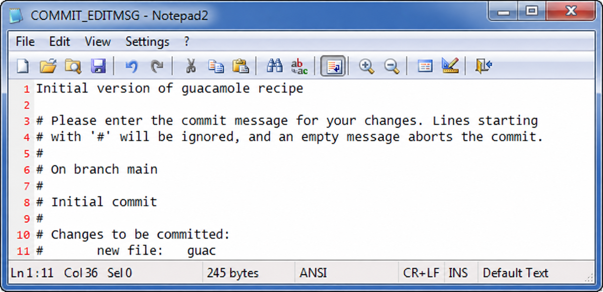
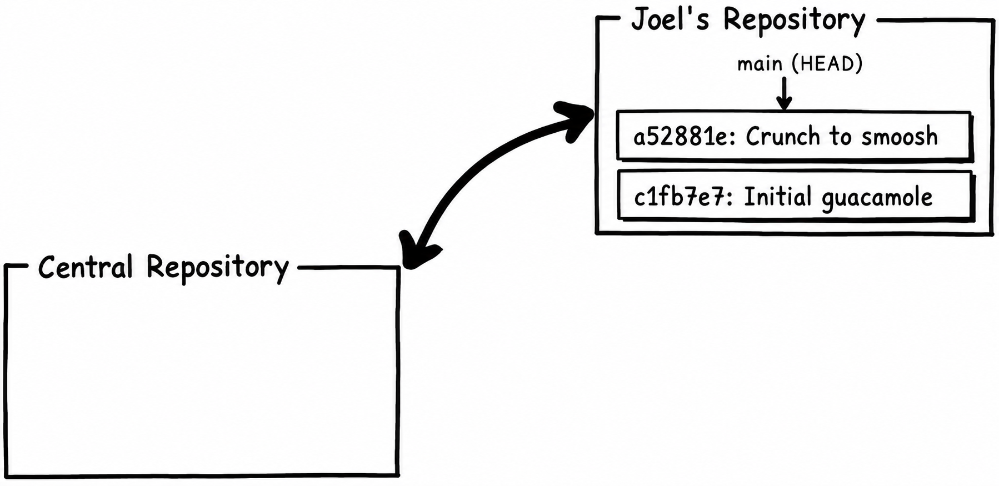
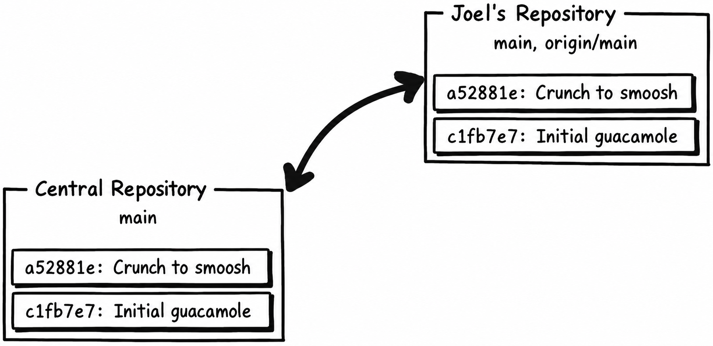
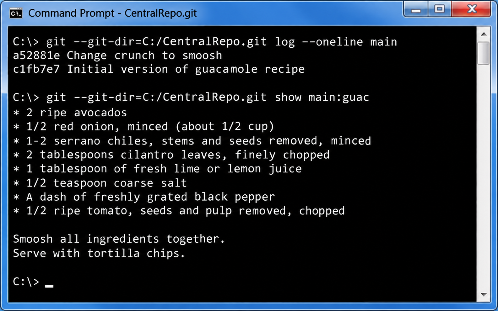
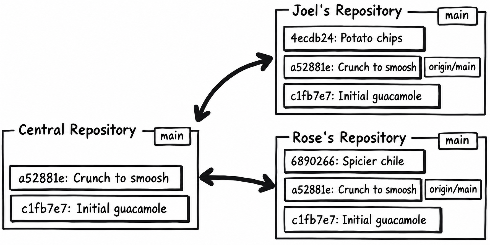
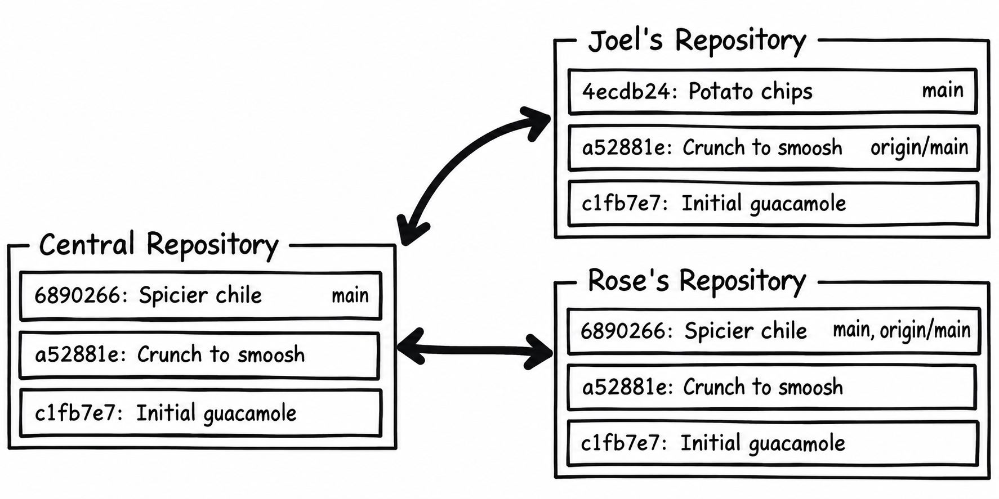
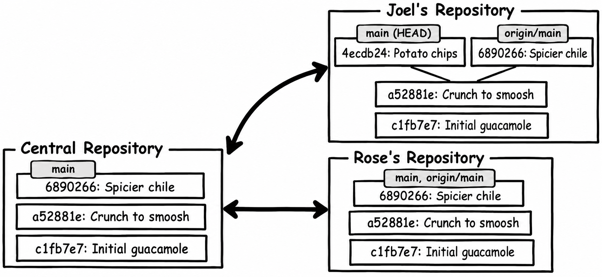
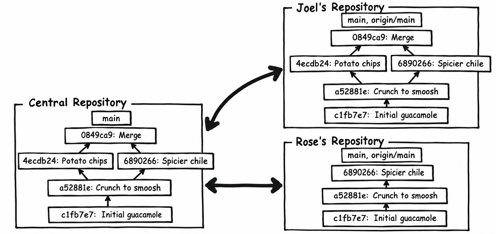

*The characters and first-person anecdotes are adapted from Joel Spolsky's original tutorial. Output is abbreviated and hashes are illustrative; use your own commit hashes when following along.*

The most common way to collaborate with Git is to set up a central repository, in addition to the private repositories that we each have on our own computers. We can use the central repository sort of like a swap meet, where we get together to trade the changes we’ve been making.

<section aria-labelledby="tip-git-init-bare" class="tip">
  <h4 id="tip-git-init-bare">git init --bare</h4>
  
creates a repository for sharing, with no checked-out working files

</section>

The quick-and-dirty way to make a central Git repository for this exercise is to create a **bare repository**. Git doesn't have an equivalent to the original tutorial's **hg serve** web server. We'll use a folder on this computer as the central repository and make separate Joel and Rose clones. A remote can be on the same disk; the commits move in exactly the same way.

<pre><samp>
C:\> <kbd>git init --bare -b main C:/CentralRepo.git</kbd>
Initialized empty Git repository in C:/CentralRepo.git/
</samp></pre>

For a real team, use an authenticated Git hosting service or a bare repository reached over SSH. Replace **C:/CentralRepo.git** in the clone commands with that repository's clone URL. Don't expose anonymous write access to the Internet.

The original tutorial shows its empty repository in a browser here. Our local bare repository has no built-in web page, so we inspect it with Git:

<pre><samp>
C:\> <kbd>git --git-dir=C:/CentralRepo.git show-ref</kbd>
</samp></pre>

There is no output yet: we have not created any commits or branch references.

<section aria-labelledby="tip-git-clone" class="tip">
  <h4 id="tip-git-clone">git clone</h4>
  
 make a complete copy of an entire repository

</section>

With the central repository ready, I can <em>clone</em> this repository <em>from</em> the server <em>onto</em> my own computer for my own use. This repository is empty right now, so I’ll just get another empty repository when I clone it.

<pre class="joel"><samp>
C:\Users\joel> <kbd>git clone C:/CentralRepo.git recipes</kbd>
Cloning into 'recipes'...
warning: You appear to have cloned an empty repository.
done.
C:\Users\joel> <kbd>cd recipes</kbd>
C:\Users\joel\recipes> <kbd>dir /a</kbd>
 Volume in drive C has no label.
 Volume Serial Number is 84BD-9C2C

 Directory of C:\Users\joel\recipes

02/08/2010  02:46 PM    &lt;DIR&gt;          .
02/08/2010  02:46 PM    &lt;DIR&gt;          ..
02/08/2010  02:46 PM    &lt;DIR&gt;          .git
               0 File(s)              0 bytes
               3 Dir(s)  41,852,125,184 bytes free
</samp></pre>

Now I’ll create a file called **guac** with my famous guacamole recipe.

<section class="diff">
<h3>guac</h3>

* 2 ripe avocados 
* 1/2 red onion, minced (about 1/2 cup) 
* 1-2 serrano chiles, stems and seeds removed, minced 
* 2 tablespoons cilantro leaves, finely chopped 
* 1 tablespoon of fresh lime or lemon juice 
* 1/2 teaspoon coarse salt 
* A dash of freshly grated black pepper 
* 1/2 ripe tomato, seeds and pulp removed, chopped  

Crunch all ingredients together. 
Serve with tortilla chips. 

</section>

I'll set my author identity with **git config user.name "Joel Spolsky"** and **git config user.email "joel@example.com"**, then add this file and commit it as the first official version. Rose should set her own identity in her clone too.

<pre class="joel"><samp>
C:\Users\joel\recipes><kbd>git add guac</kbd>

C:\Users\joel\recipes><kbd>git commit</kbd>
</samp></pre>

I’ll provide a commit comment:

I’m just going to quickly edit this file and make one small change, so
that we have a little bit of history in the repository.
<section class="diff">
<h3>guac</h3>

… 
* A dash of freshly grated black pepper 
* 1/2 ripe tomato, seeds and pulp removed, chopped  

<ins>Smoosh</ins> all ingredients together. 
Serve with tortilla chips. 

</section>

And now to commit that change:

<pre class="joel"><samp>

C:\Users\joel\recipes><kbd>git status --short</kbd>
 M guac

C:\Users\joel\recipes><kbd>git diff guac</kbd>
diff --git a/guac b/guac
--- a/guac
+++ b/guac
@@ -7,5 +7,5 @@
 * A dash of freshly grated black pepper
 * 1/2 ripe tomato, seeds and pulp removed, chopped

-Crunch all ingredients together.
+Smoosh all ingredients together.
 Serve with tortilla chips.

C:\Users\joel\recipes><kbd>git add guac</kbd>
C:\Users\joel\recipes><kbd>git commit -m "Change crunch to smoosh"</kbd>

C:\Users\joel\recipes><kbd>git log</kbd>
commit a52881ed530d
Author: Joel Spolsky &lt;joel@joelonsoftware.com&gt;
Date:   Mon Feb 08 14:51:18 2010 -0500

    Change crunch to smoosh

commit c1fb7e7fbe50
Author: Joel Spolsky &lt;joel@joelonsoftware.com&gt;
Date:   Mon Feb 08 14:50:08 2010 -0500

    Initial version of guacamole recipe
</samp></pre>

Notice that when I committed that time, I used the **-m** argument, which I haven’t done before. That’s just a way to provide the commit message on the command line, without using an editor.

OK, where are we? So far, I’ve got a central repository, and my clone of it. I’ve made two changes and committed them, but those changes are only in my clone — they’re not in the central repository yet. So the world looks like this:

<section aria-labelledby="tip-git-push" class="tip">
  <h4 id="tip-git-push">git push</h4>
  
 push new changes from this repository into another

</section>

Now I’m going to use the **git push** command, which will push my changes from my repository into the central repository:

<pre class="joel"><samp>
C:\Users\joel\recipes> <kbd>git push -u origin main</kbd>
To C:/CentralRepo.git
 * [new branch]      main -> main
branch 'main' set up to track 'origin/main'.
</samp></pre>

Git named the clone source **origin**. **-u** sets the upstream for local **main**, so later **git push** commands know which branch to update. If an actual server rejects this with an authentication error, check the clone URL, your credentials, and write access; disabling security isn't the solution.

Yay! Now the world looks like this:

I know what you’re thinking. You’re thinking, "Gosh, Joel, that’s strange. Why do these repositories contain _changes_ as opposed to _files_? Where’s that **guac** file?"

Yeah, it's weird. The boxes in these pictures show commits—the saved history—not just the latest working file. Think of the original tutorial's stack of transparencies: looking through the stack shows the latest recipe, and peeling layers back shows earlier versions. That's a useful picture of successive changes, but Git actually records snapshots linked to their parents, not a pile of patches it must replay.

The central bare repository stores the objects needed to recover **guac** at every commit, but has no working directory of its own. We can peek at the latest committed file:

<pre><samp>
C:\> <kbd>git --git-dir=C:/CentralRepo.git show main:guac</kbd>
* 2 ripe avocados
* 1/2 red onion, minced (about 1/2 cup)
* 1-2 serrano chiles, stems and seeds removed, minced
* 2 tablespoons cilantro leaves, finely chopped
* 1 tablespoon of fresh lime or lemon juice
* 1/2 teaspoon coarse salt
* A dash of freshly grated black pepper
* 1/2 ripe tomato, seeds and pulp removed, chopped

Smoosh all ingredients together.
Serve with tortilla chips.
</samp></pre>

Exactly what you would expect. A hosting service also provides a browser view of these files and commits.

Now I want Rose to help me work on the recipe. Rose is on the test team. Everyone agrees that she reminds them of those middle-aged ladies you see in Vegas, sitting there slack-jawed for hours, shoveling quarter after quarter into the slot machines, only she’s testing software. You can throw her a new version of your code and she’ll test it on 23 different Linux distros, one after the other, expressionless, unmoving, pausing only to tell you that there’s a dot missing on one of the lower-case I’s in the Turkish version on Ubuntu Linux. Rose is a great tester but I swear sometimes she acts like a zombie.

<pre class="rose"><samp>
C:\Users\rose> <kbd>git clone C:/CentralRepo.git recipes</kbd>
Cloning into 'recipes'...
done.
</samp></pre>

Rose used the **git clone** command to get her own, complete copy of the repository. **git clone** takes two arguments: the URL of the repository and the name of the directory where you want it cloned. She made her own **recipes** folder.

<pre class="rose"><samp>
C:\Users\rose> <kbd>cd recipes</kbd>

C:\Users\rose\recipes> <kbd>dir /a</kbd>
 Volume in drive C has no label.
 Volume Serial Number is 84BD-9C2C

 Directory of C:\Users\rose\recipes

02/08/2010  03:23 PM    &lt;DIR&gt;          .
02/08/2010  03:23 PM    &lt;DIR&gt;          ..
02/08/2010  03:23 PM    &lt;DIR&gt;          .git
02/08/2010  03:23 PM               394 guac
               1 File(s)            394 bytes
               3 Dir(s)  41,871,872,000 bytes free

C:\Users\rose\recipes> <kbd>git log</kbd>
commit a52881ed530d
Author: Joel Spolsky &lt;joel@joelonsoftware.com&gt;
Date:   Mon Feb 08 14:51:18 2010 -0500

    Change crunch to smoosh

commit c1fb7e7fbe50
Author: Joel Spolsky &lt;joel@joelonsoftware.com&gt;
Date:   Mon Feb 08 14:50:08 2010 -0500

    Initial version of guacamole recipe
</samp></pre>

Notice that when she types **git log** she sees the whole history. She has actually downloaded the entire repository, with its complete history of everything that happened.

Rose is going to make a change, and check it in:

<section class="diff">
<h3>guac</h3>

* 2 ripe avocados 
* 1/2 red onion, minced (about 1/2 cup) 
* 1-2 <ins>habanero</ins> chiles, stems and seeds removed, minced 
* 2 tablespoons cilantro leaves, finely chopped 
* 1 tablespoon of fresh lime or lemon juice 
… 

</section>

Now she commits it. Notice that she can do this even if the server is not running: the commit entirely happens on her machine.

<pre class="rose"><samp>
C:\Users\rose\recipes> <kbd>git diff</kbd>
diff --git a/guac b/guac
--- a/guac
+++ b/guac
@@ -1,6 +1,6 @@
 * 2 ripe avocados
 * 1/2 red onion, minced (about 1/2 cup)
-* 1-2 serrano chiles, stems and seeds removed, minced
+* 1-2 habanero chiles, stems and seeds removed, minced
 * 2 tablespoons cilantro leaves, finely chopped
 * 1 tablespoon of fresh lime or lemon juice
 * 1/2 teaspoon coarse salt

C:\Users\rose\recipes> <kbd>git add guac</kbd>
C:\Users\rose\recipes> <kbd>git commit -m "spicier kind of chile"</kbd>

C:\Users\rose\recipes> <kbd>git log</kbd>
commit 689026657682
Author: Rose Hillman &lt;rose@example.com&gt;
Date:   Mon Feb 08 15:29:09 2010 -0500

    spicier kind of chile

commit a52881ed530d
Author: Joel Spolsky &lt;joel@joelonsoftware.com&gt;
Date:   Mon Feb 08 14:51:18 2010 -0500

    Change crunch to smoosh

commit c1fb7e7fbe50
Author: Joel Spolsky &lt;joel@joelonsoftware.com&gt;
Date:   Mon Feb 08 14:50:08 2010 -0500

    Initial version of guacamole recipe
</samp></pre>

While Rose was making her change, I can make a change at the same time.

<section class="diff">
<h3>guac</h3>

… 
* 1/2 ripe tomato, seeds and pulp removed, chopped  

Smoosh all ingredients together.

Serve with <ins>potato</ins> chips.

</section>

After I check that in, you’ll see that my third commit has a different hash from Rose’s third commit. Each points back to the same earlier commit. Git uses hashes rather than local revision numbers.

<pre class="joel"><samp>
C:\Users\joel\recipes><kbd>git add guac</kbd>
C:\Users\joel\recipes><kbd>git commit -m "potato chips. No one can eat just one."</kbd>

C:\Users\joel\recipes><kbd>git log</kbd>
commit 4ecdb2401ab4
Author: Joel Spolsky &lt;joel@joelonsoftware.com&gt;
Date:   Mon Feb 08 15:32:01 2010 -0500

    potato chips. No one can eat just one.

commit a52881ed530d
Author: Joel Spolsky &lt;joel@joelonsoftware.com&gt;
Date:   Mon Feb 08 14:51:18 2010 -0500

    Change crunch to smoosh

commit c1fb7e7fbe50
Author: Joel Spolsky &lt;joel@joelonsoftware.com&gt;
Date:   Mon Feb 08 14:50:08 2010 -0500

    Initial version of guacamole recipe
</samp></pre>

Our histories are starting to diverge.

Don’t worry… in a minute we’ll see how to bring these diverging changes back together into one delicious habanero-based potato chip dip.

<section aria-labelledby="tip-git-outgoing" class="tip">
  <h4 id="tip-git-outgoing">git log origin/main..HEAD</h4>
  
 list changes in current repository waiting to be pushed

</section>

Rose can continue to work, disconnected, making as many changes as she wants, and either committing them, or reverting them, in her own repository. At some point, though, she’s going to want to share all the changes she’s been committing with the outside world. She can type **git log origin/main..HEAD** which will show a list of changes that are waiting to be sent up to the central repository. These are the changes that **git push** would send, if she were to **git push**.

<pre class="rose"><samp>
C:\Users\rose\recipes> <kbd>git log origin/main..HEAD</kbd>
commit 689026657682
Author: Rose Hillman &lt;rose@example.com&gt;
Date:   Mon Feb 08 15:29:09 2010 -0500

    spicier kind of chile
</samp></pre>

Think of **git log origin/main..HEAD** like this: it lists commits reachable from our current branch but not from our last fetched view of the server's main branch. Run **git fetch origin** first to refresh that view. This comparison is specific to those branches, not every commit anywhere in either repository.

OK, so Rose pushes her changes.

<pre class="rose"><samp>
C:\Users\rose\recipes> <kbd>git push</kbd>
To C:/CentralRepo.git
   main -> main  (fast-forward; object-transfer output omitted)
</samp></pre>

And the world looks like this:

When I get back from my fourth latte break of the day, I’m ready to push my potato-chip change, too.

<pre class="joel"><samp>
C:\Users\joel\recipes><kbd>git log origin/main..HEAD</kbd>
commit 4ecdb2401ab4
Author: Joel Spolsky &lt;joel@joelonsoftware.com&gt;
Date:   Mon Feb 08 15:32:01 2010 -0500

    potato chips. No one can eat just one.

C:\Users\joel\recipes><kbd>git push</kbd>
To C:/CentralRepo.git
 ! [rejected]        main -> main (fetch first)
error: failed to push some refs to 'C:/CentralRepo.git'
</samp></pre>

Ahhh!! Failure! Don't try to fix this with **git push -f**. That would replace the server's branch with mine, leaving Rose's commit off that branch. Fetch and integrate her work first. Trust me for now.

The reason Rose’s push succeeded while mine failed is because potato chips do not go well with guacamole. Just kidding! I wanted to see if you were awake, there.

The push failed because we both made changes, and so they need to be merged somehow, and Git knows it.

The first thing I’m going to do is get all those changes that are in the central repository that I don’t have yet, so I can merge them.

<pre class="joel"><samp>
C:\Users\joel\recipes><kbd>git fetch origin</kbd>
From C:/CentralRepo
   a52881e..6890266  main -> origin/main

C:\Users\joel\recipes> <kbd>git log --oneline HEAD..origin/main</kbd>
6890266 spicier kind of chile
</samp></pre>

My repository, which used to have three commits neatly stacked, now contains two diverging lines of history. Local **main** still points to my potato-chip commit; **origin/main** points to Rose's chile commit. Fetch downloaded her work but didn't change my branch or working files. The picture looks like this:

I’ve got both versions in my repository now… I’ve got my version:

<pre class="joel"><samp>
C:\Users\joel\recipes>  <kbd>type guac</kbd>
* 2 ripe avocados
* 1/2 red onion, minced (about 1/2 cup)
* 1-2 serrano chiles, stems and seeds removed, minced
* 2 tablespoons cilantro leaves, finely chopped
* 1 tablespoon of fresh lime or lemon juice
* 1/2 teaspoon coarse salt
* A dash of freshly grated black pepper
* 1/2 ripe tomato, seeds and pulp removed, chopped

Smoosh all ingredients together.
Serve with potato chips.
</samp></pre>

And I’ve got Rose’s version:

<pre class="joel"><samp>
C:\Users\joel\recipes> <kbd>git show origin/main:guac</kbd>
* 2 ripe avocados
* 1/2 red onion, minced (about 1/2 cup)
* 1-2 habanero chiles, stems and seeds removed, minced
* 2 tablespoons cilantro leaves, finely chopped
* 1 tablespoon of fresh lime or lemon juice
* 1/2 teaspoon coarse salt
* A dash of freshly grated black pepper
* 1/2 ripe tomato, seeds and pulp removed, chopped

Smoosh all ingredients together.
Serve with tortilla chips.
</samp></pre>

And it’s up to me to merge them. Luckily, this is easy.

<pre class="joel"><samp>
C:\Users\joel\recipes><kbd>git merge --no-commit origin/main</kbd>
Auto-merging guac
Automatic merge went well; stopped before committing as requested

C:\Users\joel\recipes> <kbd>type guac</kbd>
* 2 ripe avocados
* 1/2 red onion, minced (about 1/2 cup)
* 1-2 habanero chiles, stems and seeds removed, minced
* 2 tablespoons cilantro leaves, finely chopped
* 1 tablespoon of fresh lime or lemon juice
* 1/2 teaspoon coarse salt
* A dash of freshly grated black pepper
* 1/2 ripe tomato, seeds and pulp removed, chopped

Smoosh all ingredients together.
Serve with potato chips.
</samp></pre>

Look! The **git merge** command took my two heads and combined them together. In this case, since we both edited different parts of the file, there was no conflict at all and the merge went off without a hitch.

<section aria-labelledby="tip-git-merge" class="tip">
  <h4 id="tip-git-merge">git merge</h4>
  
 combine the current branch with another line of history

</section>

I still have to commit because I explicitly used **--no-commit**. Normally Git commits a successful non-fast-forward merge automatically. Here we pause to inspect the recipe and test it. **git merge --abort** lets us abandon an unfinished merge and try again; start merges with a clean working tree. Since this merge was successful, I'm going to commit it, then push.

<pre class="joel"><samp>
C:\Users\joel\recipes><kbd>git commit -m "merge"</kbd>

C:\Users\joel\recipes><kbd>git log</kbd>
commit 0849ca96c304
Merge: 4ecdb24 6890266
Author: Joel Spolsky &lt;joel@joelonsoftware.com&gt;
Date:   Mon Feb 08 16:07:23 2010 -0500

    merge

commit 4ecdb2401ab4
Author: Joel Spolsky &lt;joel@joelonsoftware.com&gt;
Date:   Mon Feb 08 15:32:01 2010 -0500

    potato chips. No one can eat just one.

commit 689026657682
Author: Rose Hillman &lt;rose@example.com&gt;
Date:   Mon Feb 08 15:29:09 2010 -0500

    spicier kind of chile

commit a52881ed530d
Author: Joel Spolsky &lt;joel@joelonsoftware.com&gt;
Date:   Mon Feb 08 14:51:18 2010 -0500

    Change crunch to smoosh

commit c1fb7e7fbe50
Author: Joel Spolsky &lt;joel@joelonsoftware.com&gt;
Date:   Mon Feb 08 14:50:08 2010 -0500

    Initial version of guacamole recipe

C:\Users\joel\recipes><kbd>git log origin/main..HEAD</kbd>
commit 0849ca96c304
Merge: 4ecdb24 6890266
Author: Joel Spolsky &lt;joel@joelonsoftware.com&gt;
Date:   Mon Feb 08 16:07:23 2010 -0500

    merge

commit 4ecdb2401ab4
Author: Joel Spolsky &lt;joel@joelonsoftware.com&gt;
Date:   Mon Feb 08 15:32:01 2010 -0500

    potato chips. No one can eat just one.

C:\Users\joel\recipes><kbd>git push</kbd>
To C:/CentralRepo.git
   main -> main  (fast-forward; object-transfer output omitted)
</samp></pre>

And now the central repository has the same thing as I do:

The small arrows in this illustration show history growing from older commits toward newer ones. Git itself records the relationship in the other direction: a commit stores references to its parents. The merge has both the potato-chip and chile commits as parents.

OK, I have Rose’s changes, and my changes, but Rose doesn’t have my changes yet.

One thing I forgot to tell you about Rose. She’s a doctor. Yep. A medical doctor. Isn’t that weird? She was a hotshot pediatrician at Mt. Sinai, probably earning five times as much as this crappy joint pays its testers. Nobody really knows why she left the field of medicine. The other testers think something tragic happened. She had a family, once, too; there’s a picture of a cute ten year old on her desk, but now she lives alone, and we don’t want to pry.

Rose needs to fetch the latest, incoming stuff from the repository to get it.

<pre class="rose"><samp>
C:\Users\rose\recipes> <kbd>git fetch origin</kbd>
From C:/CentralRepo
   6890266..0849ca9  main -> origin/main
</samp></pre>

Got it. Now, you may find this a bit odd, but even though Rose fetched those new changes into her repository, <em>they’re not in her working directory yet.</em>

<pre class="rose"><samp>
C:\Users\rose\recipes> <kbd>type guac</kbd>
* 2 ripe avocados
* 1/2 red onion, minced (about 1/2 cup)
* 1-2 habanero chiles, stems and seeds removed, minced
* 2 tablespoons cilantro leaves, finely chopped
* 1 tablespoon of fresh lime or lemon juice
* 1/2 teaspoon coarse salt
* A dash of freshly grated black pepper
* 1/2 ripe tomato, seeds and pulp removed, chopped

Smoosh all ingredients together.
Serve with tortilla chips.
</samp></pre>

See that? She’s still working with Tortilla chips. Tortilla chips!

She <em>does</em> have my new changes somewhere in her repository. Ask for the log of **origin/main**, because plain **git log** starts from her unchanged local branch:

<pre class="rose"><samp>
C:\Users\rose\recipes> <kbd>git log origin/main</kbd>
commit 0849ca96c304
Merge: 4ecdb24 6890266
Author: Joel Spolsky &lt;joel@joelonsoftware.com&gt;
Date:   Mon Feb 08 16:07:23 2010 -0500

    merge

commit 4ecdb2401ab4
Author: Joel Spolsky &lt;joel@joelonsoftware.com&gt;
Date:   Mon Feb 08 15:32:01 2010 -0500

    potato chips. No one can eat just one.

commit 689026657682
Author: Rose Hillman &lt;rose@example.com&gt;
Date:   Mon Feb 08 15:29:09 2010 -0500

    spicier kind of chile

commit a52881ed530d
Author: Joel Spolsky &lt;joel@joelonsoftware.com&gt;
Date:   Mon Feb 08 14:51:18 2010 -0500

    Change crunch to smoosh

commit c1fb7e7fbe50
Author: Joel Spolsky &lt;joel@joelonsoftware.com&gt;
Date:   Mon Feb 08 14:50:08 2010 -0500

    Initial version of guacamole recipe
</samp></pre>

<section aria-labelledby="tip-git-fast-forward" class="tip">
  <h4 id="tip-git-fast-forward">git merge</h4>
  
 combine the current branch with another line of history

</section>

They're just not in her working directory. That's because her local **main** and **HEAD** still point to her chile commit. You can see this with **git log -1 HEAD**:

<pre class="rose"><samp>
C:\Users\rose\recipes> <kbd>git log -1 HEAD</kbd>
commit 689026657682
Author: Rose Hillman &lt;rose@example.com&gt;
Date:   Mon Feb 08 15:29:09 2010 -0500

    spicier kind of chile
</samp></pre>

Git is being nice to us. **git fetch** brings commits into the repository and updates remote-tracking references without checking them out. We can integrate them later, at our own convenience. **git pull** is different: it fetches and then integrates, so it can change working files.

Now **git merge --ff-only origin/main** can move Rose's branch forward to the shared merge commit. Her chile commit is already an ancestor of it, so no new merge commit is necessary:

<pre class="rose"><samp>
C:\Users\rose\recipes> <kbd>git merge --ff-only origin/main</kbd>
Updating 6890266..0849ca9
Fast-forward
 guac | 2 +-
 1 file changed, 1 insertion(+), 1 deletion(-)

C:\Users\rose\recipes> <kbd>type guac</kbd>
* 2 ripe avocados
* 1/2 red onion, minced (about 1/2 cup)
* 1-2 habanero chiles, stems and seeds removed, minced
* 2 tablespoons cilantro leaves, finely chopped
* 1 tablespoon of fresh lime or lemon juice
* 1/2 teaspoon coarse salt
* A dash of freshly grated black pepper
* 1/2 ripe tomato, seeds and pulp removed, chopped

Smoosh all ingredients together.
Serve with potato chips.
</samp></pre>

And now, she’s looking at the latest version with everybody’s changes.

When you're working on a team, your workflow is going to look a lot like this:

1. With a clean working tree, get the latest version:
   - **git fetch origin**
   - **git merge --ff-only origin/main** (if this refuses, inspect the divergence)
2. Make some changes.
3. Stage them with **git add**, review **git diff --staged**, and commit locally.
4. Repeat steps 2–3 until you've got some nice code you're willing to inflict on everyone else.
5. When you're ready to share:
   - **git fetch origin** to download everyone else's changes
   - **git merge --no-commit origin/main** to integrate them
   - test! to make sure the merge didn't screw anything up
   - **git commit** if the merge is waiting for a commit
   - **git push**

A fast-forward can still happen with **--no-commit**; that moves the branch directly and doesn't leave a merge commit to finish. This exercise uses a shared main branch to make the exchange visible. On a real team, the same ideas apply to feature branches and reviewed pull requests.

## Test yourself

Here are the things you should know how to do after reading this tutorial:

1. Set up a central repository and let team members clone off of it
2. Push changes into the central repository
3. Fetch changes from the central repository and integrate them when ready
4. Merge changes from different contributors
