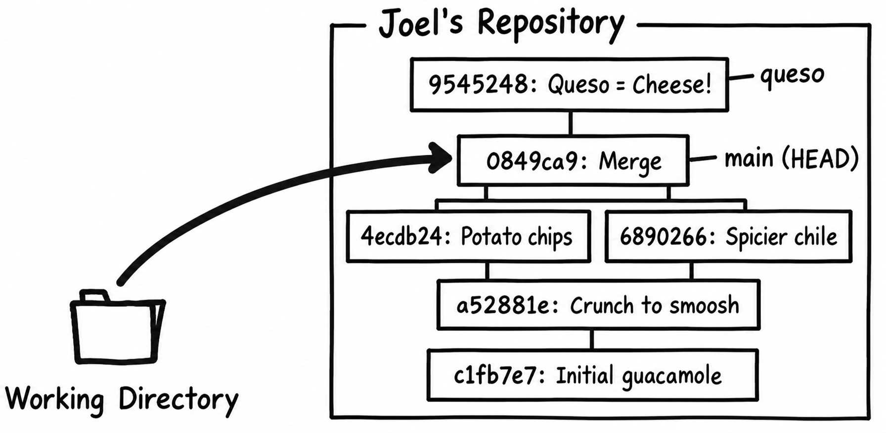
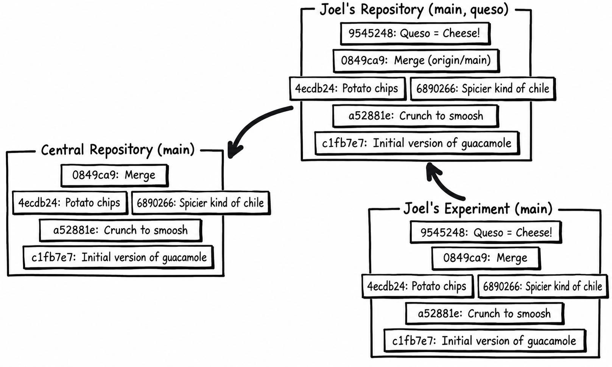

*The first-person stories and characters are adapted from Joel Spolsky's original tutorial. This continues the recipe history from the previous chapter; example hashes are illustrative.*

Git lets you experiment freely. Imagine that during the course of normal editing, you get into trouble with your editor and do something catastrophic:

<section class="diff">
<h3>guac</h3>

* 2 <del>ripe avocados</del><ins>iperay avocadosway</ins> 
* 1/2 red onion, minced (about 1/2 cup) 
* 1-2 habanero chiles, stems and seeds removed, minced 
* 2 tablespoons cilantro leaves, finely chopped 
* 1 tablespoon of fresh lime or lemon juice 
* 1/2 teaspoon coarse salt 
* A dash of freshly grated black pepper 
* 1/2 ripe tomato, seeds and pulp removed, chopped 
 
<del>Smoosh all ingredients together</del> <ins>Ooshsmay allway ingredientsway ogethertay</ins>. 
<del>Serve with potato chips</del> <ins>Ervesay ithway otatopay ipschay</ins>. 

</section>

Gotta love emacs. Anyway, all is not lost. The most common way to recover from these things is just to **git restore** them:

<section aria-labelledby="tip-git-restore" class="tip">
  <h4 id="tip-git-restore">git restore</h4>
  
restore unstaged working-file edits from the staging area

</section>

<pre><samp>
C:\Users\joel\recipes> <kbd>git restore guac</kbd>
</samp></pre>

Because we haven't staged these edits, that puts **guac** back exactly as it was at the last commit. Git discards the unwanted [Pig Latin](https://en.wikipedia.org/wiki/Pig_Latin); it does not automatically save a **guac.orig** backup. Review **git diff** first. If you'd like to keep a copy, copy the file yourself before restoring it.

What if you staged the mistake? **git restore --staged guac** removes it from the staging area while keeping the edited working file. You can then review it and decide whether to restore the working file too.

To explore the next case, edit the recipe back into Pig Latin and stage it again.

What if you had gone one step too far and actually committed?

<pre><samp>
C:\Users\joel\recipes> <kbd>git add guac</kbd>
C:\Users\joel\recipes> <kbd>git commit -m "Pig Latin ftw"</kbd>

C:\Users\joel\recipes> <kbd>git log -3</kbd>
commit c7af1973de6d
Author: Joel Spolsky &lt;joel@joelonsoftware.com&gt;
Date:   Thu Feb 11 11:32:27 2010 -0500

    Pig Latin ftw

commit 0849ca96c304
Merge: 4ecdb24 6890266
Author: Joel Spolsky &lt;joel@joelonsoftware.com&gt;
Date:   Mon Feb 08 16:07:23 2010 -0500

    merge

commit 4ecdb2401ab4
Author: Joel Spolsky &lt;joel@joelonsoftware.com&gt;
Date:   Mon Feb 08 15:32:01 2010 -0500

    potato chips. No one can eat just one.
</samp></pre>

<section aria-labelledby="tip-git-reset" class="tip">
  <h4 id="tip-git-reset">git reset --mixed HEAD~1</h4>
  
 undoes one commit, as long as you haven't pushed it to anyone else.

</section>

**git reset --mixed HEAD~1** moves the current branch back one commit and resets the staging area, leaving your edited working files alone. Here it undoes our unpublished Pig Latin commit. Use it on private history; if you've already shared the commit, use **git revert** as we'll do later. **HEAD~1** means the first parent of the current commit, not a numbered revision.

<pre><samp>
C:\Users\joel\recipes> <kbd>git reset --mixed HEAD~1</kbd>
Unstaged changes after reset:
M	guac

C:\Users\joel\recipes> <kbd>git log -3</kbd>
commit 0849ca96c304
Merge: 4ecdb24 6890266
Author: Joel Spolsky &lt;joel@joelonsoftware.com&gt;
Date:   Mon Feb 08 16:07:23 2010 -0500

    merge

commit 4ecdb2401ab4
Author: Joel Spolsky &lt;joel@joelonsoftware.com&gt;
Date:   Mon Feb 08 15:32:01 2010 -0500

    potato chips. No one can eat just one.

commit 689026657682
Author: Rose Hillman &lt;rose@example.com&gt;
Date:   Mon Feb 08 15:29:09 2010 -0500

    spicier kind of chile

C:\Users\joel\recipes> <kbd>git status --short</kbd>
 M guac

C:\Users\joel\recipes> <kbd>git restore guac</kbd>
</samp></pre>

Imagine you want to do a major experiment on the side. Your boss hired a new designer, Jim, and lately the specs you've been getting from him are just absurd. There's fluorescent green text, nothing lines up (for "artistic" reasons), and the usability is awful. You want to come in one weekend and redo the whole thing, but you're afraid to commit it because you're not really 100% sure that your ideas are better than this nutty graphic designer. Jim is basically smoking a joint from the moment he wakes up until he goes to bed. You don't want to hold that against him, and everybody else thinks that it's nobody's business as long as his designs are good, but really, there's a limit. Right? And his designs aren't good. Plus he's kind of offensive.

With Git, you can just make an experimental clone of the entire repository:

<pre><samp>
C:\Users\joel\recipes> <kbd>cd ..</kbd>

C:\Users\joel&gt; <strong>git clone recipes recipes-experiment</strong>
Cloning into 'recipes-experiment'...
done.
</samp></pre>

This isn't as inefficient as it seems. Because both **recipes** and **recipes-experiment** share all their history (so far), Git can use a file system trick called "hard links" for local object files on a filesystem that supports them so that the copy can be created very quickly, without taking up a lot of extra space on disk.

A branch in the same repository would also work, but let's keep the original tutorial's separate experimental directory. Now we can make a bunch of changes in that clone:

<pre><samp>
C:\Users\joel&gt; <strong>cd recipes-experiment</strong>
</samp></pre>

Here's my grand guacamole experiment:

<section class="diff">
<h3>guac</h3>

… 
Smoosh all ingredients together. 
Serve with potato chips. 

<ins>This recipe is really good served with QUESO.  

QUESO is Spanish for "cheese," but in Texas,
it's just Kraft Slices melted in the microwave
with some salsa from a jar. MMM!</ins>

</section>

Here in the experimental repository, we can commit freely.

<pre><samp>
C:\Users\joel\recipes-experiment> <kbd>git config user.name "Joel Spolsky"</kbd>
C:\Users\joel\recipes-experiment> <kbd>git config user.email "joel@example.com"</kbd>
C:\Users\joel\recipes-experiment> <kbd>git add guac</kbd>
C:\Users\joel\recipes-experiment> <kbd>git commit -m "Queso = Cheese!"</kbd>
</samp></pre>

You can make changes and work freely, committing whenever you want. That gives you all the power of source control even for your crazy experiment, without infecting anyone else.

If you decide that the experiment was misguided, you can delete the experimental directory once you're sure nothing valuable exists only there. The original clone still has its own working files and history.

But if it worked, you can push your new changes into a new branch in the original clone. Git normally refuses a push into another non-bare repository's checked-out branch. We avoid that by naming a separate destination branch, **queso**:

<pre><samp>
C:\Users\joel\recipes-experiment>  <kbd>git push origin HEAD:refs/heads/queso</kbd>
To C:/Users/joel/recipes
 * [new branch]      HEAD -> queso
</samp></pre>

Where did they go?

<section aria-labelledby="tip-git-remotes" class="tip">
  <h4 id="tip-git-remotes">git remote -v</h4>
  
 shows a list of known remote repositories 

</section>

<pre><samp>
C:\Users\joel\recipes-experiment>  <kbd>git remote -v</kbd>
origin  C:/Users/joel/recipes (fetch)
origin  C:/Users/joel/recipes (push)
</samp></pre>

The **origin** entry is the repository we cloned from. In this case it's a local directory, but it could also be a URL. Our explicit **HEAD:refs/heads/queso** refspec says to send the current commit to the remote's **queso** branch. It does not advance the remote's checked-out **main**.

<pre><samp>
C:\Users\joel\recipes-experiment> <kbd>cd ..\recipes</kbd>
</samp></pre>

Don't forget, just because the change has been pushed into this __repository__…

<pre><samp>
C:\Users\joel\recipes> <kbd>git log -3 queso</kbd>
commit 9545248f3fc9
Author: Joel Spolsky &lt;joel@joelonsoftware.com&gt;
Date:   Thu Feb 11 12:59:11 2010 -0500

    Queso = Cheese!

commit 0849ca96c304
Merge: 4ecdb24 6890266
Author: Joel Spolsky &lt;joel@joelonsoftware.com&gt;
Date:   Mon Feb 08 16:07:23 2010 -0500

    merge

commit 689026657682
Author: Rose Hillman &lt;rose@example.com&gt;
Date:   Mon Feb 08 15:29:09 2010 -0500

    spicier kind of chile
</samp></pre>

… doesn't mean we're working off that version yet.

<pre><samp>
C:\Users\joel\recipes> <kbd>type guac</kbd>
* 2 ripe avocados
* 1/2 red onion, minced (about 1/2 cup)
* 1-2 habanero chiles, stems and seeds removed, minced
* 2 tablespoons cilantro leaves, finely chopped
* 1 tablespoon of fresh lime or lemon juice
* 1/2 teaspoon coarse salt
* A dash of freshly grated black pepper
* 1/2 ripe tomato, seeds and pulp removed, chopped

Smoosh all ingredients together.
Serve with potato chips.

C:\Users\joel\recipes> <kbd>git log -1 HEAD</kbd>
commit 0849ca96c304
Merge: 4ecdb24 6890266
Author: Joel Spolsky &lt;joel@joelonsoftware.com&gt;
Date:   Mon Feb 08 16:07:23 2010 -0500

    merge
</samp></pre>

<section aria-labelledby="tip-git-head" class="tip">
  <h4 id="tip-git-head">git log -1 HEAD</h4>
  
 shows the current commit

</section>

See? That "Queso" stuff is in commit **9545248**, on branch **queso**. But **main** still points to the earlier merge, **0849ca9**. Just because someone pushed new commits into the __repository__ doesn't mean they've appeared in its working directory.

To bring the successful experiment into **main**, I can fast-forward to **queso**:

<pre><samp>
C:\Users\joel\recipes> <kbd>git merge --ff-only queso</kbd>
Updating 0849ca9..9545248
Fast-forward

C:\Users\joel\recipes> <kbd>git log -1 HEAD</kbd>
commit 9545248f3fc9
Author: Joel Spolsky &lt;joel@joelonsoftware.com&gt;
Date:   Thu Feb 11 12:59:11 2010 -0500

    Queso = Cheese!

C:\Users\joel\recipes> <kbd>type guac</kbd>
* 2 ripe avocados
* 1/2 red onion, minced (about 1/2 cup)
* 1-2 habanero chiles, stems and seeds removed, minced
* 2 tablespoons cilantro leaves, finely chopped
* 1 tablespoon of fresh lime or lemon juice
* 1/2 teaspoon coarse salt
* A dash of freshly grated black pepper
* 1/2 ripe tomato, seeds and pulp removed, chopped

Smoosh all ingredients together.
Serve with potato chips.

This recipe is really good served with QUESO.

QUESO is Spanish for "cheese," but in Texas,
it's just Kraft Slices melted in the microwave
with some salsa from a jar. MMM!
</samp></pre>

See what happened here? The push created a separate branch in our repository. Then the fast-forward brought those commits into the branch we were working on and updated the working files. **git fetch** also downloads commits without updating the working tree. **git pull**, however, fetches and integrates, so don't confuse it with fetch.

Right now here's the state of repositories:

Git is flexible about moving changes around from repository to repository. You can push straight from the experimental repository into the central repository:

<pre><samp>
C:\Users\joel\recipes> <kbd>cd ..\recipes-experiment</kbd>

C:\Users\joel\recipes-experiment> 

<kbd>git remote add central C:/CentralRepo.git</kbd>
C:\Users\joel\recipes-experiment> <kbd>git fetch central</kbd>
C:\Users\joel\recipes-experiment> <kbd>git log central/main..HEAD</kbd>
commit 9545248f3fc9
Author: Joel Spolsky &lt;joel@joelonsoftware.com&gt;
Date:   Thu Feb 11 12:59:11 2010 -0500

    Queso = Cheese!

C:\Users\joel\recipes-experiment> 

<kbd>git push central HEAD:main</kbd>
To C:/CentralRepo.git
   0849ca9..9545248  HEAD -> main
</samp></pre>

That pushed the Queso commit from the experimental repo directly into the central repository. Now, if I go back to my repository, there's nothing left to push!

<pre><samp>
C:\Users\joel\recipes-experiment> <kbd>cd ..\recipes</kbd>

C:\Users\joel\recipes> <kbd>git fetch origin</kbd>
From C:/CentralRepo
   0849ca9..9545248  main -> origin/main
C:\Users\joel\recipes> <kbd>git log origin/main..HEAD</kbd>
</samp></pre>

There's no log output. After fetching, Git knows that the central branch already contains this same commit from somewhere else. That's really useful, because otherwise it would try to apply it again, and it would be massively confused.

After they made a job offer to designer Jim, he said he would start work right away, but then he didn't show up for two months. People had mostly forgotten about him and about the job offer, and when he showed up at the office for the first time to start work, looking rather sunburned, to be honest, nobody quite knew who he was or what was going on. It was pretty funny. He is kind of a generic looking guy. Eventually they figured it out, but since he was new, nobody had the guts to ask him what the hell had happened. Just like they never ask him about the bruises and scratches on his face. Whatever. We hate that guy.

Sometimes it may happen that you discover that, months earlier, you made a mistake.

<pre><samp>
C:\Users\joel\recipes> <kbd>git diff a52881ed530d 4ecdb2401ab4 -- guac</kbd>
diff --git a/guac b/guac
--- a/guac
+++ b/guac
@@ -8,4 +8,4 @@
 * 1/2 ripe tomato, seeds and pulp removed, chopped

 Smoosh all ingredients together.
-Serve with tortilla chips.
+Serve with potato chips.
</samp></pre>

Potato chips? WTF?!

Git can reverse an old commit for you. **git revert** figures out the __opposite__ of its patch and applies it on top of the current work. Let's reverse the potato-chip commit, using **--no-commit** so we can inspect the result before recording it.

<pre><samp>
C:\Users\joel\recipes> <kbd>git revert --no-commit 4ecdb2401ab4</kbd>
Auto-merging guac
CONFLICT (content): Merge conflict in guac
error: could not revert 4ecdb24... potato chips. No one can eat just one.
</samp></pre>

Holy crap, what just happened? Git tried to reverse the old edit, but the Queso paragraph we added immediately afterward overlaps the area it needs to merge. This particular example needs a little help. Open **guac** and you'll see a conflict near the end (the commit label may differ):

<pre><samp>
Smoosh all ingredients together.
&lt;&lt;&lt;&lt;&lt;&lt;&lt; HEAD
Serve with potato chips.

This recipe is really good served with QUESO.

QUESO is Spanish for "cheese," but in Texas,
it's just Kraft Slices melted in the microwave
with some salsa from a jar. MMM!
&#61;&#61;&#61;&#61;&#61;&#61;&#61;
Serve with tortilla chips.
&gt;&gt;&gt;&gt;&gt;&gt;&gt; parent of 4ecdb24 (potato chips. No one can eat just one.)
</samp></pre>

Keep the Queso paragraphs, change **potato** back to **tortilla**, and remove the three conflict-marker lines and the duplicate serving line. The end of the file should be:

<pre><samp>
Smoosh all ingredients together.
Serve with tortilla chips.

This recipe is really good served with QUESO.

QUESO is Spanish for "cheese," but in Texas,
it's just Kraft Slices melted in the microwave
with some salsa from a jar. MMM!
</samp></pre>

Stage the resolved file with **git add guac**. Now inspect the inverse change with **git diff --staged**:

<pre><samp>
C:\Users\joel\recipes> <kbd>git add guac</kbd>
C:\Users\joel\recipes> <kbd>git diff --staged</kbd>
diff --git a/guac b/guac
--- a/guac
+++ b/guac
@@ -8,7 +8,7 @@
 * 1/2 ripe tomato, seeds and pulp removed, chopped

 Smoosh all ingredients together.
-Serve with potato chips.
+Serve with tortilla chips.

 This recipe is really good served with QUESO.

C:\Users\joel\recipes> <kbd>git commit -m "undo thing from the past"</kbd>

C:\Users\joel\recipes> <kbd>git push</kbd>
To C:/CentralRepo.git
   9545248..d828920  main -> main
</samp></pre>

Ordinary **git revert** also creates the undo commit; here **--no-commit** let us review and give it our own message. The earlier potato-chip commit remains in history. We've added a new commit reversing it, while keeping the Queso addition.

Now, a lot of time may have passed. The chips might already be gone from the recipe. All kinds of spooky stuff might have happened that makes it impossible to merge in this change. In that case, you’re going to get merge conflicts, which you’re going to have to resolve somehow. For a conflicted revert, resolve the file, stage it, and use **git revert --continue**, or **git revert --abort** to cancel. We’ll talk about conflicts in the next tutorial.

## Test yourself

Here are the things you should know how to do after reading this tutorial:

1. Revert accidental changes, before and after checking in
2. Clone a repository locally for experiments
3. Push between repositories
4. Revert an old mistake that’s been in the repository for ages
