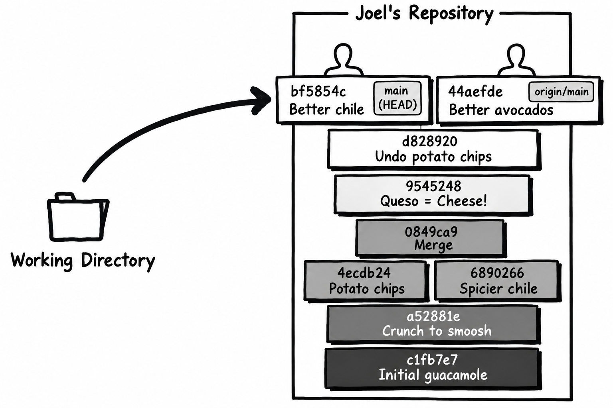
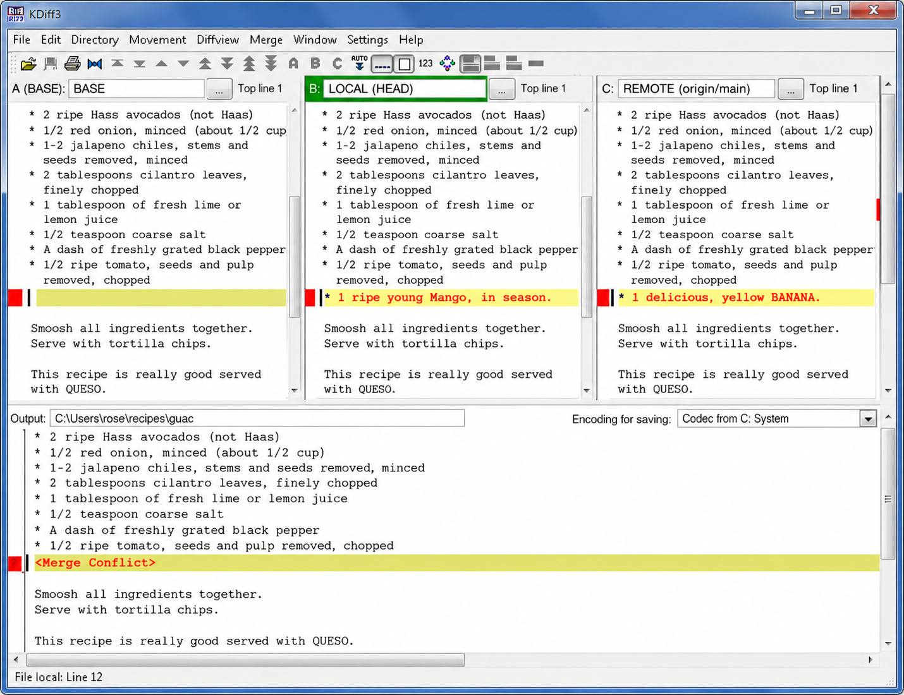
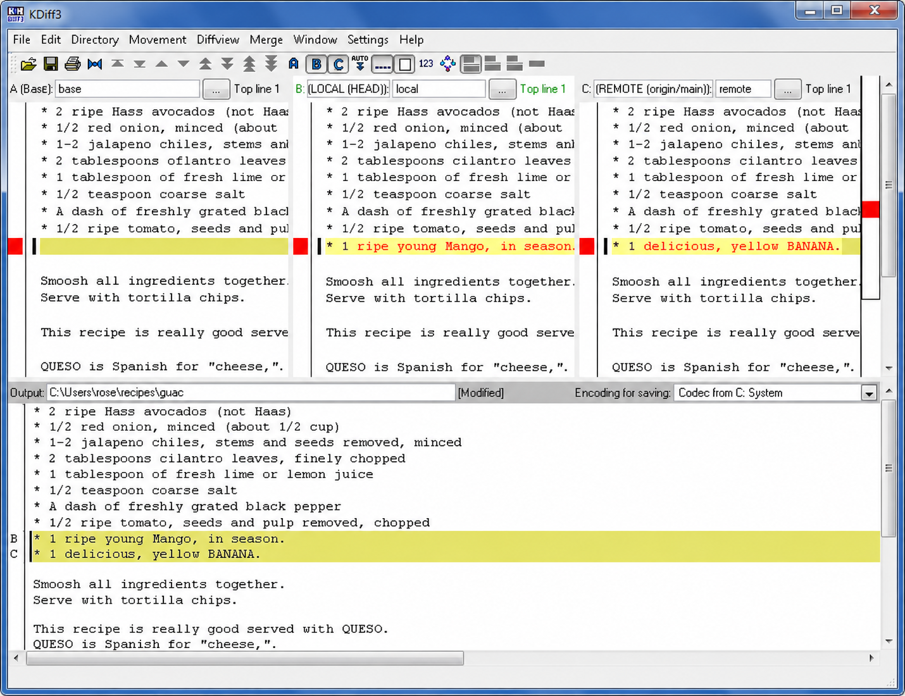

*Adapted from Joel Spolsky's original tutorial. This continues the previous chapter's recipe, with Queso and tortilla chips. Hashes and abbreviated output are illustrative.*

An important part of version control is coordinating the work of multiple people on the same code base.

Imagine that Rose and I both want to make a change to the guacamole recipe. Rose is improving the avocado quality. Before she starts, she's going to pull all the latest changes from the central repository so that she's totally up to date.

<pre class="rose"><samp>
C:\Users\rose\recipes>  <kbd>git fetch origin</kbd>
Remote objects downloaded; origin/main updated (transfer output omitted).

C:\Users\rose\recipes>  <kbd>git merge --ff-only origin/main</kbd>
Fast-forward
</samp></pre>

Now an edit:

<section class="diff">
<h3>guac</h3>

* 2 ripe <ins>Hass</ins> avocados <ins>(not Haas)</ins> 
* 1/2 red onion, minced (about 1/2 cup) 
* 1-2 habanero chiles, stems and seeds removed, minced 
…

</section>

She commits and pushes the change off to the central repository:

<pre class="rose"><samp>
C:\Users\rose\recipes>  <kbd>git diff</kbd>
diff --git a/guac b/guac
--- a/guac
+++ b/guac
@@ -1,4 +1,4 @@
-* 2 ripe avocados
+* 2 ripe Hass avocados (not Haas)
 * 1/2 red onion, minced (about 1/2 cup)
 * 1-2 habanero chiles, stems and seeds removed, minced
 * 2 tablespoons cilantro leaves, finely chopped

C:\Users\rose\recipes>  <kbd>git add guac</kbd>
C:\Users\rose\recipes>  <kbd>git commit -m "better avocados"</kbd>

C:\Users\rose\recipes>  <kbd>git push</kbd>
To C:/CentralRepo.git
   main -> main  (fast-forward; transfer output omitted)
</samp></pre>

Simultaneously, I make a change in a different part of the file:

<section class="diff">
<h3>guac</h3>

* 2 ripe avocados 
* 1/2 red onion, minced (about 1/2 cup) 
* 1-2 <ins>jalapeno</ins> chiles, stems and seeds removed, minced 
…

</section>

I can commit, but I can't push to the central repository.

<pre class="joel"><samp>
C:\Users\joel\recipes>  <kbd>git diff</kbd>
diff --git a/guac b/guac
--- a/guac
+++ b/guac
@@ -1,6 +1,6 @@
 * 2 ripe avocados
 * 1/2 red onion, minced (about 1/2 cup)
-* 1-2 habanero chiles, stems and seeds removed, minced
+* 1-2 jalapeno chiles, stems and seeds removed, minced
 * 2 tablespoons cilantro leaves, finely chopped
 * 1 tablespoon of fresh lime or lemon juice
 * 1/2 teaspoon coarse salt

C:\Users\joel\recipes>  <kbd>git add guac</kbd>
C:\Users\joel\recipes>  <kbd>git commit -m "better chile"</kbd>

C:\Users\joel\recipes>  <kbd>git push</kbd>
To C:/CentralRepo.git
 ! [rejected]        main -> main (fetch first)
error: failed to push some refs to 'C:/CentralRepo.git'
</samp></pre>

That error is Git protecting Rose's work. Here's what it means, in less formal language (this next box is my translation, not Git's actual output):

<pre class="joel"><samp>
C:\Users\joel\recipes>  <kbd>git push</kbd>
ZOMG!!! There are changes in that repo that you don't have yet.
Don't push now. Fetch the latest changes and merge them first.
</samp></pre>

And indeed that is what I will do:

<pre class="joel"><samp>
C:\Users\joel\recipes>  <kbd>git fetch origin</kbd>
Remote objects downloaded; origin/main updated (transfer output omitted).

</samp></pre>

Wondering what just arrived? The **git log HEAD..origin/main** command is a handy way to find out.

<pre class="joel"><samp>
C:\Users\joel\recipes>  <kbd>git log HEAD..origin/main</kbd>
commit 44aefdeef9e0
Author: Rose Hillman &lt;rose@example.com&gt;
Date:   Thu Feb 11 17:10:48 2010 -0500

    better avocados
</samp></pre>

Indeed, it's Rose's change from earlier. What's going on with my repository right now?

<pre class="joel"><samp>
C:\Users\joel\recipes>  <kbd>git log --oneline --left-right HEAD...origin/main</kbd>
&lt; bf5854c better chile
&gt; 44aefde better avocados

C:\Users\joel\recipes>  <kbd>git log -1 HEAD</kbd>
commit bf5854ca20f7
Author: Joel Spolsky &lt;joel@joelonsoftware.com&gt;
Date:   Thu Feb 11 17:12:23 2010 -0500

    better chile
</samp></pre>

My local **main** and **origin/main** have diverged. Essentially, my repository looks like this:

See the two branch tips? Rose and I both started from the tortilla-chip undo commit at the end of the previous chapter. Her avocado commit and my chile commit share that parent. So now a merge is needed. \[Ed: Never use passive voice!\] _I need to merge._

<pre class="joel"><samp>
C:\Users\joel\recipes>  <kbd>git merge --no-commit origin/main</kbd>
Auto-merging guac
Automatic merge went well; stopped before committing as requested
</samp></pre>

The merge command, **git merge --no-commit origin/main**, combined the two histories. Then it left the result staged and in my working directory. It did not commit because I asked it to pause with **--no-commit**; normally a successful divergent merge is committed automatically. That gives me a chance to check that the merge is correct:

<pre class="joel"><samp>
C:\Users\joel\recipes> <strong>type guac</strong>
* 2 ripe Hass avocados (not Haas)
* 1/2 red onion, minced (about 1/2 cup)
* 1-2 jalapeno chiles, stems and seeds removed, minced
* 2 tablespoons cilantro leaves, finely chopped
* 1 tablespoon of fresh lime or lemon juice
* 1/2 teaspoon coarse salt
* A dash of freshly grated black pepper
* 1/2 ripe tomato, seeds and pulp removed, chopped

Smoosh all ingredients together.
Serve with tortilla chips.

This recipe is really good served with QUESO.

QUESO is Spanish for "cheese," but in Texas,
it's just Kraft Slices melted in the microwave
with some salsa from a jar. MMM!
</samp></pre>

That looks right; the avocados are Hass and the chiles are Jalapenos. So I'll go ahead and commit and push that to the server.

<pre class="joel"><samp>
C:\Users\joel\recipes>  <kbd>git commit -m "merge"</kbd>

C:\Users\joel\recipes>  <kbd>git push</kbd>
To C:/CentralRepo.git
   main -> main  (fast-forward; transfer output omitted)
</samp></pre>

I'm pushing two commits: my original jalapeno change, and then the merge, which is its own commit.

Notice that nothing about our two changes conflicted, since Rose and I were working on different parts of the recipe. So the merge was super duper easy. That's the most common case, because in most organizations, each programmer is assigned to work on a different part of the code.

Sometimes you have a dysfunctional organization where nobody is willing to really put their foot down about who is supposed to work on what. This can cause sudden and often unexplained feelings of sadness among the programming staff. This is hard to detect. Symptoms can include: programmers locking themselves in bathrooms, programmers locking themselves in the server closet, high turnover, muted sobbing sounds in the cube farm, and sudden eardrum trauma caused by the sound of repeated firing of a military-class assault rifle.

BUT, even in the best-managed and healthiest organizations, merge conflicts do sometimes occur, and Git will require the merging person to resolve the conflict. Let's see what that looks like.

First… I want to bring Rose up to speed with my jalapeno changes:

<pre class="rose"><samp>
C:\Users\rose\recipes>  <kbd>git fetch origin</kbd>
C:\Users\rose\recipes>  <kbd>git log HEAD..origin/main</kbd>
commit 8646f8cd7154
Merge: bf5854c 44aefde
Author: Joel Spolsky &lt;joel@joelonsoftware.com&gt;
Date:   Thu Feb 11 21:51:26 2010 -0500

    merge

commit bf5854ca20f7
Author: Joel Spolsky &lt;joel@joelonsoftware.com&gt;
Date:   Thu Feb 11 17:12:23 2010 -0500

    better chile

C:\Users\rose\recipes>  <kbd>git fetch origin</kbd>
Remote objects downloaded; origin/main updated (transfer output omitted).

C:\Users\rose\recipes>  <kbd>git merge --ff-only origin/main</kbd>
Fast-forward
</samp></pre>

Now we're going to see what happens when you have a gen-yoo-ine conflict: we're both going to muck with the ingredients a bit.

I added a banana:

<section class="diff">
<h3>guac</h3>

* 2 ripe Hass avocados (not Haas) 
* 1/2 red onion, minced (about 1/2 cup) 
* 1-2 jalapeno chiles, stems and seeds removed, minced 
* 2 tablespoons cilantro leaves, finely chopped 
* 1 tablespoon of fresh lime or lemon juice 
* 1/2 teaspoon coarse salt 
* A dash of freshly grated black pepper 
* 1/2 ripe tomato, seeds and pulp removed, chopped 
<ins>* 1 delicious, yellow BANANA.</ins>  
Smoosh all ingredients together. 
Serve with tortilla chips.

</section>

I checked in the banana change first:

<pre class="joel"><samp>
C:\Users\joel\recipes>  <kbd>git diff</kbd>
diff --git a/guac b/guac
--- a/guac
+++ b/guac
@@ -6,6 +6,7 @@
 * 1/2 teaspoon coarse salt
 * A dash of freshly grated black pepper
 * 1/2 ripe tomato, seeds and pulp removed, chopped
+* 1 delicious, yellow BANANA.

 Smoosh all ingredients together.
 Serve with tortilla chips.

C:\Users\joel\recipes>  <kbd>git add guac</kbd>
C:\Users\joel\recipes>  <kbd>git commit -m "bananas YUM"</kbd>

C:\Users\joel\recipes>  <kbd>git push</kbd>
To C:/CentralRepo.git
   main -> main  (fast-forward; transfer output omitted)
</samp></pre>

And Rose, bless her heart, added a MANGO on the EXACT SAME LINE.

<section class="diff">
<h3>guac</h3>

* 2 ripe Hass avocados (not Haas) 
* 1/2 red onion, minced (about 1/2 cup) 
* 1-2 jalapeno chiles, stems and seeds removed, minced 
* 2 tablespoons cilantro leaves, finely chopped 
* 1 tablespoon of fresh lime or lemon juice 
* 1/2 teaspoon coarse salt 
* A dash of freshly grated black pepper 
* 1/2 ripe tomato, seeds and pulp removed, chopped 
<ins>* 1 ripe young Mango, in season.</ins>  
Smoosh all ingredients together. 
Serve with tortilla chips. 

</section>

"Ripe young" mango, indeed.

<pre class="rose"><samp>
C:\Users\rose\recipes>  <kbd>git diff</kbd>
diff --git a/guac b/guac
--- a/guac
+++ b/guac
@@ -6,6 +6,7 @@
 * 1/2 teaspoon coarse salt
 * A dash of freshly grated black pepper
 * 1/2 ripe tomato, seeds and pulp removed, chopped
+* 1 ripe young Mango, in season.

 Smoosh all ingredients together.
 Serve with tortilla chips.

C:\Users\rose\recipes>  <kbd>git add guac</kbd>
C:\Users\rose\recipes>  <kbd>git commit -m "mmmmango"</kbd>
</samp></pre>

This time I got my change in first so Rose is going to have to merge. HA!

<pre class="rose"><samp>
C:\Users\rose\recipes>  <kbd>git fetch origin</kbd>
Remote objects downloaded; origin/main updated (transfer output omitted).

C:\Users\rose\recipes>  <kbd>git merge origin/main</kbd>
Auto-merging guac
CONFLICT (content): Merge conflict in guac
Automatic merge failed; fix conflicts and then commit the result.
</samp></pre>

And suddenly, the conflict is detected. Git stops and marks **guac** as unmerged; it does not launch a graphical tool automatically. Rose can edit the conflict markers by hand, or use a merge tool with a user interface that only its mother could love. Once configured, these tools can be quite good at what they do.

This tutorial keeps the original KDiff3 walkthrough. With KDiff3 installed and available to Git, run **git mergetool --tool=kdiff3 -- guac**. If the executable isn't on your PATH, set its location with **git config mergetool.kdiff3.path "C:/path/to/kdiff3.exe"**, replacing the example path. It shows Rose the following:

In KDiff3, you see four panes. The top left is the original file. Top center shows Rose her version. Top right shows Rose my version. The bottom pane is an editor where Rose constructs a merged file with the conflicts resolved.

Fixing conflicts is a relatively simple matter of going through each conflict and choosing how to resolve it. Rose goes crazy and decides that Banana Mango Guacamole couldn't be that bad:

By the way, did I tell you that Rose seems to be dating? The other day she was seen leaving work with a guy that sort-of looked like Dennis Franz. She's been in the best mood anyone has seen her in years.

Rose saves the merged result and exits KDiff3. A successful mergetool run normally stages the resolved file; she explicitly stages it and checks the staged diff before committing. If resolving by hand, remove the conflict markers, save the chosen result, and use the same add/diff/commit sequence.

<pre class="rose"><samp>
C:\Users\rose\recipes>  <kbd>git add guac</kbd>
C:\Users\rose\recipes>  <kbd>git diff --staged</kbd>
diff --git a/guac b/guac
--- a/guac
+++ b/guac
@@ -7,6 +7,7 @@
 * A dash of freshly grated black pepper
 * 1/2 ripe tomato, seeds and pulp removed, chopped
 * 1 ripe young Mango, in season.
+* 1 delicious, yellow BANANA.

 Smoosh all ingredients together.
 Serve with tortilla chips.

C:\Users\rose\recipes>  <kbd>git commit -m "merge"</kbd>

C:\Users\rose\recipes>  <kbd>git push</kbd>
To C:/CentralRepo.git
   main -> main  (fast-forward; transfer output omitted)
</samp></pre>

And the conflict is resolved.

One thing you should keep in mind: you do not have to merge on anybody's schedule. You can **git fetch origin** whenever you want, and if you don't feel like merging the conflicts, you're free to keep working, and committing, happily, until you have time to think about the merge. Once you start a conflicting merge, finish it or use **git merge --abort** before returning to unrelated work. Start with a clean working tree, and test the final recipe before committing.

## Test yourself

Here are the things you should know how to do after reading this tutorial:

1. Work on a code base with other people
2. Get their changes
3. Push your changes
4. Resolve merge conflicts that may come up from time to time
5. Diagnose certain classes of programmer melancholy
