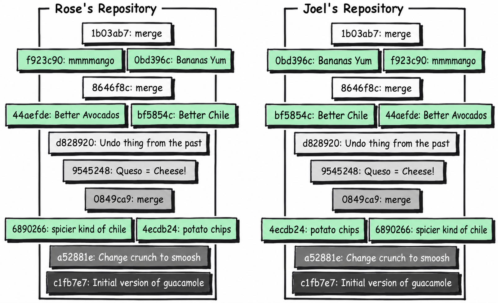
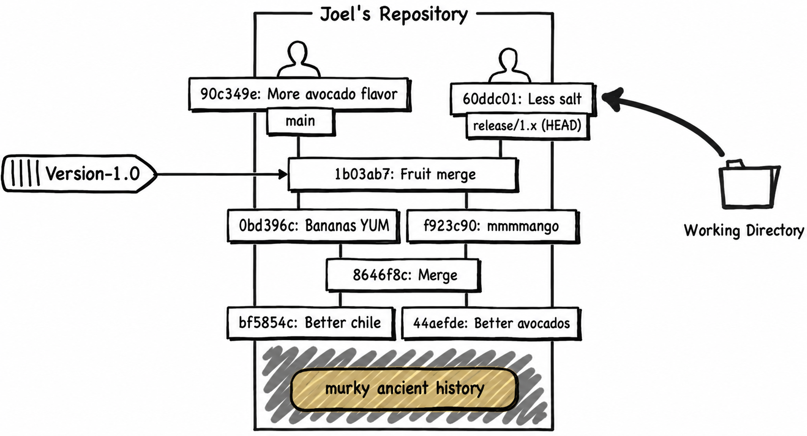
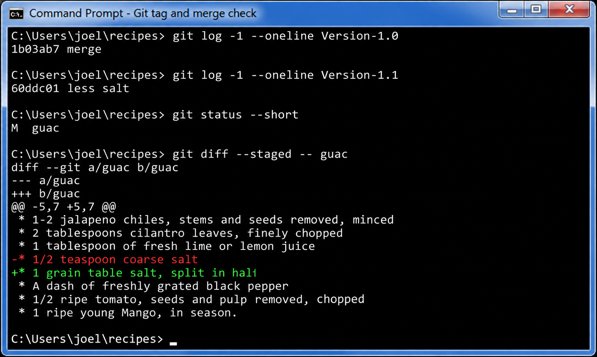
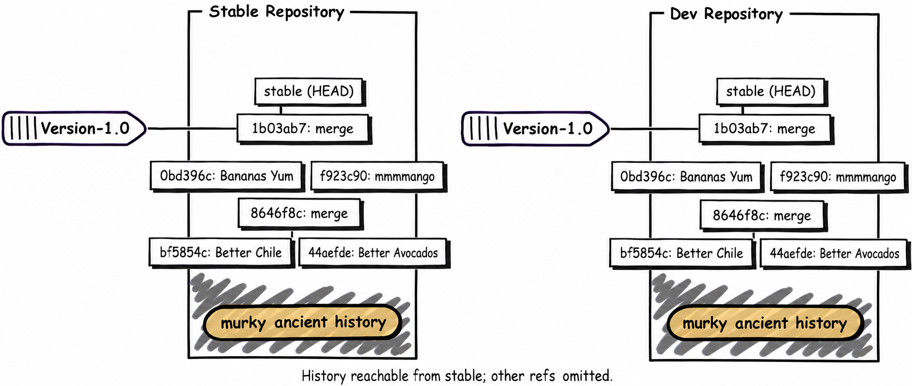
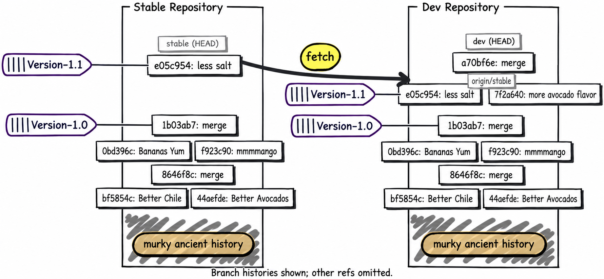
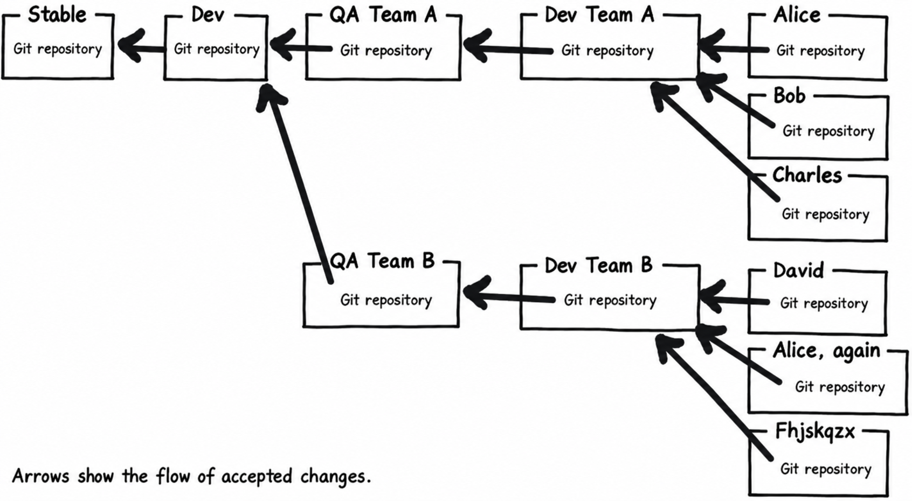

*The first-person anecdotes are adapted from Joel Spolsky's original tutorial. Commit hashes and abbreviated output are illustrative.*

Our recipe is getting pretty good. First, Joel fetches Rose's finished fruit merge and fast-forwards to it with **git fetch origin** and **git merge --ff-only origin/main**:

<pre><samp>
C:\Users\joel\recipes> <kbd>git log -3</kbd>
commit 1b03ab783b17
Merge: f923c90 0bd396c
Author: Rose Hillman &lt;rose@example.com&gt;
Date:   Thu Feb 11 23:01:55 2010 -0500

    merge

commit f923c9049234
Author: Rose Hillman &lt;rose@example.com&gt;
Date:   Thu Feb 11 22:49:31 2010 -0500

    mmmmango

commit 0bd396c9b89b
Author: Joel Spolsky &lt;joel@joelonsoftware.com&gt;
Date:   Thu Feb 11 22:46:47 2010 -0500

    bananas YUM
</samp></pre>

Let's look more closely at that commit identifier:

<pre><samp>
commit <strong>1b03ab783b17</strong>
</samp></pre>

Git doesn't assign each commit a local revision number like 13. You can count commits, but two people on diverging branches might mean different things by "the thirteenth commit." A commit's hash is the reliable identity shared across repositories.

So, for all intents and purposes, I can't tell people "OK, let's ship our thirteenth commit." That's why there's that crazy hexadecimal identifier. The full hash identifies the same commit wherever it is copied; the short prefix must be long enough to be unique in your repository.

OK, so now I could tell people, "Hey, we're shipping today! Commit 1b03ab783b17!" Wouldn't it be nice if I could give this commit a _name_?

Well, you can. It's called a **tag**.

<pre><samp>
C:\Users\joel\recipes> <kbd>git tag -a Version-1.0 -m "Guacamole 1.0"</kbd>
</samp></pre>

Let's look at the log now:

<pre><samp>
C:\Users\joel\recipes> <kbd>git log -1 --oneline --decorate</kbd>
1b03ab7 (HEAD -> main, tag: Version-1.0, origin/main) merge
</samp></pre>

Notice that adding the tag did **not** create another commit. An annotated Git tag is a separate object pointing to the commit. Every time I want to refer to the version we shipped, I can use **Version-1.0** instead of **1b03ab783b17**.

The tag starts out local. Publish it explicitly with **git push origin Version-1.0**. Treat published release tags as fixed names; don't quietly move them to different commits.

The CEO came down from the 31st floor for the office ship party, with a crate of rather expensive looking sparkling wine. Stan got a little bit drunk. Well, not a little. Nobody had ever seen anything like it. He was taking off his shirt, showing off his muscles and not insignificant flab, and trying to impress some women from the marketing department. "I'm gonna do pullups from the lights," he brags (we have these long fluorescent lights). So he jumps up, grabs the fixture, and of course, pulls down the whole thing immediately, since it was a ten pound light fixture hanging from a couple of thin pieces of piano wire, and his weight was somewhere in that hotly contested zone between 290 and 300 pounds. He pulls down the whole light and a lot of ceiling tiles, too, shattered glass and acoustic-tile-material everywhere, and lands smack on his tailbone whining about how he's going to sue the company for making an unsafe work environment.

The rest of us went back to our cubes, to work on Guac 2.0.

<section class="diff">
<h3>guac</h3>

<ins>GUACAMOLE 2.0 THIS IS GOING TO BE AWESOME</ins>  

* 2<ins>00</ins> ripe Hass avocados (not Haas) 
* 1/2 red onion, minced (about 1/2 cup) 
* 1-2 jalapeno chiles, stems and seeds removed, minced 
* 2 tablespoons cilantro leaves, finely chopped 
* 1 tablespoon of fresh lime or lemon juice 
* 1/2 teaspoon coarse salt 
* A dash of freshly grated black pepper 
* 1/2 ripe tomato, seeds and pulp removed, chopped 
* 1 ripe young Mango, in season. 
* 1 delicious, yellow BANANA. 

</section>

Commit:

<pre><samp>
C:\Users\joel\recipes> <kbd>git add guac</kbd>
C:\Users\joel\recipes> <kbd>git commit -m "more avocado flavor"</kbd>
</samp></pre>

Needless to say, the recipe here is in a very unsettled state. It hasn't been tested or anything. And then, the (one) customer calls up.

"It's too salty!" he whimpers. And no, he doesn't want to wait for version 2.0 for a fix.

Luckily, we've got that tag. I can create a release branch from it with **git switch -c release/1.x Version-1.0**. That checks out the shipped recipe and gives the fix a branch of its own.

<pre><samp>
C:\Users\joel\recipes> <kbd>git switch -c release/1.x Version-1.0</kbd>
Switched to a new branch 'release/1.x'

C:\Users\joel\recipes> <kbd>type guac</kbd>
* 2 ripe Hass avocados (not Haas)
* 1/2 red onion, minced (about 1/2 cup)
* 1-2 jalapeno chiles, stems and seeds removed, minced
...
</samp></pre>

And now I can fix his stupid salt problem:

<section class="diff">
<h3>guac</h3>

* 2 ripe Hass avocados (not Haas) 
* 1/2 red onion, minced (about 1/2 cup) 
* 1-2 jalapeno chiles, stems and seeds removed, minced 
* 2 tablespoons cilantro leaves, finely chopped 
* 1 tablespoon of fresh lime or lemon juice 
* <ins>1 grain table </ins>salt<ins>, split in half</ins> 
* A dash of freshly grated black pepper 
* 1/2 ripe tomato, seeds and pulp removed, chopped 
* 1 ripe young Mango, in season. 
* 1 delicious, yellow BANANA. 

</section>

And:

<pre><samp>
C:\Users\joel\recipes> <kbd>git diff</kbd>
diff --git a/guac b/guac
--- a/guac
+++ b/guac
@@ -3,7 +3,7 @@
 * 1-2 jalapeno chiles, stems and seeds removed, minced
 * 2 tablespoons cilantro leaves, finely chopped
 * 1 tablespoon of fresh lime or lemon juice
-* 1/2 teaspoon coarse salt
+* 1 grain table salt, split in half
 * A dash of freshly grated black pepper
 * 1/2 ripe tomato, seeds and pulp removed, chopped
 * 1 ripe young Mango, in season.

C:\Users\joel\recipes> <kbd>git add guac</kbd>
C:\Users\joel\recipes> <kbd>git commit -m "less salt"</kbd>

</samp></pre>

There are two lines of work now: **main** contains the unfinished 2.0 change, and **release/1.x** contains the salt fix based on 1.0.

Now I can ship this to my customer, tag it as 1.1, and go back to work on version 2.0.

<pre><samp>
C:\Users\joel\recipes> <kbd>git tag -a Version-1.1 -m "Guacamole 1.1: less salt"</kbd>
C:\Users\joel\recipes> <kbd>git log -1 --oneline --decorate</kbd>
60ddc01 (HEAD -> release/1.x, tag: Version-1.1) less salt

C:\Users\joel\recipes> <kbd>git switch main</kbd>
Switched to branch 'main'

C:\Users\joel\recipes> <kbd>type guac</kbd>
GUACAMOLE 2.0 THIS IS GOING TO BE AWESOME

* 200 ripe Hass avocados (not Haas)
* 1/2 red onion, minced (about 1/2 cup)
* 1-2 jalapeno chiles, stems and seeds removed, minced
* 2 tablespoons cilantro leaves, finely chopped
* 1 tablespoon of fresh lime or lemon juice
* 1/2 teaspoon coarse salt
* A dash of freshly grated black pepper
* 1/2 ripe tomato, seeds and pulp removed, chopped
* 1 ripe young Mango, in season.
* 1 delicious, yellow BANANA.
...
</samp></pre>

Only one problem… the salt fix is not here. How do I solve that?

<pre><samp>
C:\Users\joel\recipes> <kbd>git merge --no-commit release/1.x</kbd>
Auto-merging guac
Automatic merge went well; stopped before committing as requested
</samp></pre>

The original Mercurial example needed a merge of its **.hgtags** file here. Git has no tracked tag file to merge. Both tag names remain where we put them: **Version-1.0** at the original release, **Version-1.1** at the salt fix. We merge the release branch's code into **main**, inspect the result, then commit it.

<pre><samp>
C:\Users\joel\recipes> <kbd>git diff --staged -- guac</kbd>
diff --git a/guac b/guac
--- a/guac
+++ b/guac
@@ -5,7 +5,7 @@
 * 1-2 jalapeno chiles, stems and seeds removed, minced
 * 2 tablespoons cilantro leaves, finely chopped
 * 1 tablespoon of fresh lime or lemon juice
-* 1/2 teaspoon coarse salt
+* 1 grain table salt, split in half
 * A dash of freshly grated black pepper
 * 1/2 ripe tomato, seeds and pulp removed, chopped
 * 1 ripe young Mango, in season.

C:\Users\joel\recipes> <kbd>git commit -m "bringing in salt fix from 1.1"</kbd>
</samp></pre>

This simple method of going back to old, tagged versions is fine for when you just want to make one little unexpected fix to shipping code. But the truth is, in most software projects, this kind of stuff happens all the time, and you may prefer separate working directories for stable maintenance and development.

So let's replay that same example from 1.0 in fresh directories. We keep all the work we just did. This second exercise starts from the Version-1.0 tag, so we can compare the two-repository approach.

<pre><samp>
C:\Users\joel\recipes> <kbd>cd ..</kbd>

C:\Users\joel> <kbd>git clone --no-tags recipes recipes-stable</kbd>
Cloning into 'recipes-stable'...
done.

C:\Users\joel> <kbd>cd recipes-stable</kbd>
C:\Users\joel\recipes-stable> <kbd>git fetch origin tag Version-1.0</kbd>
From C:/Users/joel/recipes
 * [new tag]         Version-1.0 -> Version-1.0
C:\Users\joel\recipes-stable> <kbd>git switch -c stable Version-1.0</kbd>
Switched to a new branch 'stable'
C:\Users\joel\recipes-stable> <kbd>git config user.name "Joel Spolsky"</kbd>
C:\Users\joel\recipes-stable> <kbd>git config user.email "joel@example.com"</kbd>
C:\Users\joel\recipes-stable> <kbd>git log -1 --oneline</kbd>
1b03ab7 merge
</samp></pre>

**--no-tags** avoids importing the first exercise's Version-1.1 tag, so we can create that release name for our replayed fix. We fetch just **Version-1.0**, then create **stable** at that tag before making commits. This clone still contains other history and remote-tracking branches; it is the **stable** branch that starts at 1.0.

The idea is that instead of doing everything in one repository, we're going to make two repositories, one called **stable** and the other called **dev**.

The **stable** repository holds the last major version of the code that we shipped to customers. Whenever you need to make an urgent bug fix, you do it in **stable**. In this example it's going to be all the patches to 1.0.

The **dev** repository is where the next major train of development is happening, leading up to 2.0.

As soon as 1.0 ships, I'm going to clone **stable** to **dev**:

<pre><samp>
C:\Users\joel\recipes-stable <kbd>cd ..</kbd>

C:\Users\joel> <kbd>git clone --branch stable recipes-stable recipes-dev</kbd>
Cloning into 'recipes-dev'...
done.
</samp></pre>

Now both working directories start at the same release commit:

Since these are local clones, Git can use hard links for stored objects where supported. Each still has its own working directory. Git branches or **git worktree** can also provide parallel work areas; separate clones are useful here because they make the direction of sharing obvious.

Now we start working on that guac in the **dev** repository:

<pre><samp>
C:\Users\joel> <kbd>cd recipes-dev</kbd>
C:\Users\joel\recipes-dev> <kbd>git branch -m dev</kbd>
C:\Users\joel\recipes-dev> <kbd>git config user.name "Joel Spolsky"</kbd>
C:\Users\joel\recipes-dev> <kbd>git config user.email "joel@example.com"</kbd>

C:\Users\joel\recipes-dev>  <kbd>notepad guac</kbd>

C:\Users\joel\recipes-dev>  <kbd>git diff</kbd>
diff --git a/guac b/guac
--- a/guac
+++ b/guac
@@ -1,4 +1,6 @@
-* 2 ripe Hass avocados (not Haas)
+GUACAMOLE 2.0 THIS IS GOING TO BE AWESOME
+
+* 200 ripe Hass avocados (not Haas)
 * 1/2 red onion, minced (about 1/2 cup)
 * 1-2 jalapeno chiles, stems and seeds removed, minced
 * 2 tablespoons cilantro leaves, finely chopped

C:\Users\joel\recipes-dev> <kbd>git add guac</kbd>
C:\Users\joel\recipes-dev> <kbd>git commit -m "more avocado flavor"</kbd>
</samp></pre>

And fix the salt problem in the stable repository:

<pre><samp>
C:\Users\joel\recipes-dev>  <kbd>cd ..\recipes-stable</kbd>

C:\Users\joel\recipes-stable>  <kbd>edit guac</kbd>

C:\Users\joel\recipes-stable>  <kbd>git diff</kbd>
diff --git a/guac b/guac
--- a/guac
+++ b/guac
@@ -3,7 +3,7 @@
 * 1-2 jalapeno chiles, stems and seeds removed, minced
 * 2 tablespoons cilantro leaves, finely chopped
 * 1 tablespoon of fresh lime or lemon juice
-* 1/2 teaspoon coarse salt
+* 1 grain table salt, split in half
 * A dash of freshly grated black pepper
 * 1/2 ripe tomato, seeds and pulp removed, chopped
 * 1 ripe young Mango, in season.

C:\Users\joel\recipes-stable>  <kbd>git add guac</kbd>
C:\Users\joel\recipes-stable>  <kbd>git commit -m "less salt"</kbd>
</samp></pre>

I'll tag that and ship it as 1.1:

<pre><samp>
C:\Users\joel\recipes-stable>  <kbd>git tag -a Version-1.1 -m "Guacamole 1.1: less salt"</kbd>
</samp></pre>

And now, every once in a while, we pull in the fixes from stable to dev:

<pre><samp>
C:\Users\joel\recipes-stable>  <kbd>cd ..\recipes-dev</kbd>

C:\Users\joel\recipes-dev>  <kbd>git fetch origin</kbd>
C:\Users\joel\recipes-dev> <kbd>git log --oneline HEAD..origin/stable</kbd>
e05c954 less salt

C:\Users\joel\recipes-dev> <kbd>git merge --no-commit origin/stable</kbd>
Auto-merging guac
Automatic merge went well; stopped before committing as requested

C:\Users\joel\recipes-dev> <kbd>git commit -m "merge"</kbd>

C:\Users\joel\recipes-dev> <kbd>type guac</kbd>
GUACAMOLE 2.0 THIS IS GOING TO BE AWESOME

* 200 ripe Hass avocados (not Haas)
* 1/2 red onion, minced (about 1/2 cup)
* 1-2 jalapeno chiles, stems and seeds removed, minced
* 2 tablespoons cilantro leaves, finely chopped
* 1 tablespoon of fresh lime or lemon juice
* 1 grain table salt, split in half
* A dash of freshly grated black pepper
* 1/2 ripe tomato, seeds and pulp removed, chopped
* 1 ripe young Mango, in season.
* 1 delicious, yellow BANANA.

Smoosh all ingredients together.
Serve with tortilla chips.

This recipe is really good served with QUESO.

QUESO is Spanish for "cheese," but in Texas,
it's just Kraft Slices melted in the microwave
with some salsa from a jar. MMM!
</samp></pre>

Here's what we've been doing:

And, if you can understand _that_ crazy graph, you're well on your way to understanding Git. The gist of it is that eventually the **stable** branch only advances with bug fixes, while **dev** has new code and those fixes merged in. Our clones may store other commits too; branch membership, not merely the presence of an object, determines each line's history.

There are other ways you can use multiple repositories.

- You can set up a team repository where a few people work on a feature together. When they are finished and the feature works well, you push the changes from the team repository to the main development repository, and then everyone else sees it.
- You can set up a QA repository for the testers. Instead of pushing into the main repository, you push into the QA repository where your code is tested. Once the testers approve it, you push from the QA repository into the main development repository. That way the main repository always contains tested code.
- Since each developer has their own repository, you can pull an experimental commit from your friend to test it, without inflicting that change on the rest of the team.

In large, complicated organizations, you can combine these techniques, setting up a bunch of repositories that pull from each other. As each feature goes through testing and integration, it gets pulled up higher and higher in the tree until eventually the new code is in the main shipping repository where customers can get it:

## Test yourself

Here are the things you should know how to do after reading this tutorial:

1. Tag old versions and go back to them
2. Organize your team with "stable" and "dev" repositories

Well, somehow we've reached the end of this tutorial. I haven't even come _close_ to covering everything in Git, but there are plenty of resources to go more in depth.
There's [a book](https://git-scm.com/book/en/v2) that covers everything in utter and complete detail.
